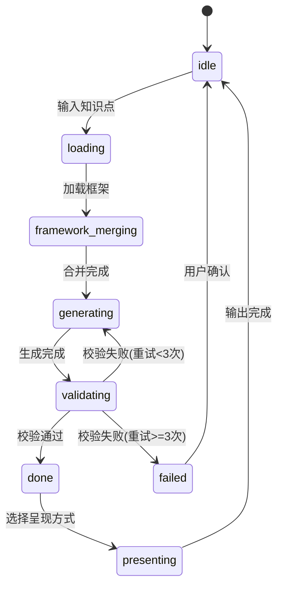

# 知本（KnowledgeRoot）- 模块设计

## 三、怎么做（坡度三阶段）

### 阶段1：点出概念

> **系统架构一句话概述**：知本 = 框架引擎（管理框架+插件）+ 知识图谱（管理关联）+ 内容生成器（大模型+约束+校验）+ 呈现管线（多形态输出），通过学段适配器实现认知能力匹配。

### 阶段2：建立联系

**模块划分**：

| 模块名 | 职责 | 关键属性 | 深入？ |
|-------|------|---------|-------|
| **框架引擎** | 管理主框架和范式族插件，提供合并能力 | 主框架定义、范式族插件注册表、合并规则 | ✅ |
| **范式族插件** | 定义各认知范式族的差异化拆解规则 | 范式族规则、学科微调、微框架 | ✅ |
| **知识图谱** | 管理知识点关联关系 | 节点、边、前导/后续/跨学科查询 | ❌ |
| **学段适配器** | 根据学段调整内容表述 | 学段规则、语言风格、锚点类型 | ❌ |
| **内容生成器** | 调用大模型生成结构化内容 | Prompt构建、大模型调用、质量校验 | ✅ |
| **呈现管线** | 将结构化内容转换为多形态输出 | HTML交互、视频、PPT等 | ❌ |

**接口契约**：

| 接口 | 输入 | 输出 | 说明 |
|-----|------|------|------|
| `decompose` | 知识点ID + 学科 + 学段 | 七维拆解结果 | 核心接口：拆解一个知识点 |
| `generate` | 拆解结果 + 输出格式 | 呈现内容 | 生成可呈现的教学内容 |
| `validate` | 知识点ID + 理解程度 | 验证题目集 | 生成本质理解型验证题目 |
| `navigate` | 起始知识点 + 目标知识点 | 知识路径 | 在知识图谱中导航 |
| `merge_framework` | 学科 + 学段 | 合并后的框架约束 | 框架引擎内部接口 |
| `quality_check` | 生成内容 | 质量评分+问题列表 | 内容生成器内部接口 |

### 阶段3：详细解释

**全局状态设计**：

```python
from typing import TypedDict, Optional, List
from datetime import datetime

class AppState(TypedDict):
    """项目级全局状态 - 所有模块共享"""
    # 当前上下文
    current_point_id: Optional[str]        # 当前知识点
    current_subject: Optional[str]          # 当前学科
    current_grade: Optional[int]            # 当前学段
    
    # 生成状态
    current_decomposition: Optional[dict]   # 当前拆解结果
    generation_status: str                  # idle/generating/validating/done/failed
    quality_score: Optional[float]          # 质量评分
    
    # 用户状态
    user_role: Optional[str]                # teacher/student
    learning_path: List[str]                # 学习路径（知识点ID列表）
    
    # 错误状态
    errors: List[dict]                      # 错误信息
```

**方法设计（核心流程状态流转）**：



**路由设计（多场景分发）**：

```
知识点输入
    │
    ├── 路由1：按学科 → 范式族插件选择
    │   ├── 数学/物理/化学 → 形式科学族插件
    │   ├── 语文/历史/英语 → 人文学科族插件
    │   └── 生物/地理 → 生命科学族插件
    │
    ├── 路由2：按学段 → 表述规则选择
    │   ├── 1-3年级 → 低年级规则
    │   ├── 4-6年级 → 中年级规则
    │   ├── 7-9年级 → 初中规则
    │   └── 10-12年级 → 高中规则
    │
    └── 路由3：按输出格式 → 呈现管线选择
        ├── HTML交互 → HTML交互管线
        ├── 视频 → 视频管线（后续）
        └── PPT → PPT管线（后续）
```

**模块依赖关系**：

```
框架引擎 ←── 范式族插件（插件注册到引擎）
    ↓
内容生成器 ←── 框架引擎（获取合并后的框架约束）
    ↓           ←── 学段适配器（获取学段规则）
    ↓
呈现管线 ←── 内容生成器（获取结构化内容）
    ↑
知识图谱（独立模块，被内容生成器和呈现管线引用）
```
