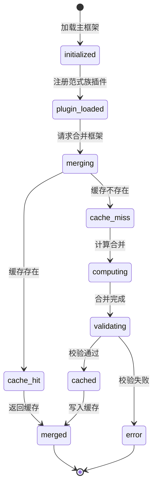

# 框架引擎 - 四层设计

## 模块内部状态

```python
from dataclasses import dataclass, field
from typing import Dict, List, Optional
from enum import Enum

class DimensionName(str, Enum):
    DEFINITION = "definition"          # 定义锚点
    ORIGIN = "origin"                  # 历史溯源
    CONTRADICTION = "contradiction"    # 现实矛盾
    APPLICATION = "application"        # 应用场景
    EXTENSION = "extension"            # 思维延伸
    NETWORK = "network"                # 知识网络
    VALIDATION = "validation"          # 验证理解

class DimensionGroup(str, Enum):
    COGNITION = "cognition"            # 认知组（理解）
    APPLICATION_GROUP = "application_group"  # 应用组（迁移）
    VERIFICATION = "verification"      # 验证组（确认）

@dataclass
class DimensionRule:
    """单个维度的规则定义"""
    name: DimensionName
    group: DimensionGroup
    essential_question: str            # 本质问题（如"它是什么？"）
    cognitive_goal: str                # 认知目标
    rules: List[str]                   # 生成规则列表
    constraints: List[str]             # 硬约束列表
    example: str                       # 示例

@dataclass
class SevenDimensionFramework:
    """七维主框架"""
    dimensions: Dict[DimensionName, DimensionRule] = field(default_factory=dict)
    
    # 维度分组
    groups: Dict[DimensionGroup, List[DimensionName]] = field(default_factory=lambda: {
        DimensionGroup.COGNITION: [
            DimensionName.DEFINITION,
            DimensionName.ORIGIN,
            DimensionName.CONTRADICTION,
        ],
        DimensionGroup.APPLICATION_GROUP: [
            DimensionName.APPLICATION,
            DimensionName.EXTENSION,
            DimensionName.NETWORK,
        ],
        DimensionGroup.VERIFICATION: [
            DimensionName.VALIDATION,
        ],
    })

@dataclass
class FrameworkEngineState:
    """框架引擎内部状态 - 模块级单一状态源"""
    main_framework: SevenDimensionFramework
    registered_plugins: Dict[str, dict]  # paradigm_family_id → plugin_data
    merged_cache: Dict[str, dict]        # cache_key → merged_framework
```

## 四层基础设施

| 层面 | 设计内容 |
|-----|---------|
| **数据规矩** | `DimensionRule` 定义每个维度的规则结构；`DimensionName` 枚举限制维度名；`DimensionGroup` 枚举限制分组；`SevenDimensionFramework` 定义主框架结构 |
| **数据存储** | 主框架定义存储为 Python 模块（代码即数据）；范式族插件存储为 YAML 文件（`plugins/{family_id}.yaml`）；合并结果缓存到内存字典 |
| **数据流转** | 加载主框架 → 加载范式族插件 → 按维度合并（插件规则覆盖主框架通用规则）→ 缓存合并结果；缓存键 = `{subject}:{grade}` |
| **接口层** | `FrameworkEngineService` Protocol（见下方） |

## 对外接口契约

```python
from typing import Protocol, Dict, List, Optional

@dataclass
class MergedDimensionRule:
    """合并后的维度规则"""
    name: DimensionName
    group: DimensionGroup
    essential_question: str
    cognitive_goal: str
    rules: List[str]           # 主框架规则 + 范式族规则 + 学科微调
    constraints: List[str]     # 主框架约束 + 范式族约束 + 学科微调
    example: str
    grade_adjustments: Optional[dict]  # 学段适配调整

@dataclass
class MergedFramework:
    """合并后的完整框架"""
    subject: str
    grade: int
    paradigm_family: str
    dimensions: Dict[DimensionName, MergedDimensionRule]
    dimension_order: List[DimensionName]  # 维度呈现顺序
    micro_frameworks: List[dict]          # 微框架列表（如4W时间锚）

class FrameworkEngineService(Protocol):
    """框架引擎对外接口"""
    
    def get_merged_framework(
        self, subject: str, grade: int
    ) -> MergedFramework:
        """获取合并后的框架（主框架+范式族插件+学科微调+学段适配）"""
        ...
    
    def register_plugin(
        self, family_id: str, plugin_data: dict
    ) -> None:
        """注册范式族插件"""
        ...
    
    def get_dimension_rule(
        self, subject: str, grade: int, dimension: DimensionName
    ) -> MergedDimensionRule:
        """获取单个维度的合并规则"""
        ...
    
    def validate_framework(
        self, framework: MergedFramework
    ) -> List[str]:
        """校验框架完整性，返回问题列表"""
        ...
```

## 状态流转图



## 合并规则详解

框架合并的核心逻辑：**主框架提供通用规则，范式族插件覆盖/补充学科规则，学科微调补充特有规则，学段适配调整表述方式。**

```
合并优先级（高→低）：
  学科微调 > 范式族插件 > 主框架

合并策略：
  rules:     主框架.rules + 范式族.rules + 学科微调.rules（追加，不覆盖）
  constraints: 主框架.constraints + 范式族.constraints + 学科微调.constraints（追加）
  essential_question: 范式族.essential_question（覆盖主框架）
  cognitive_goal: 范式族.cognitive_goal（覆盖主框架）
  example: 范式族.example（覆盖主框架）
```
