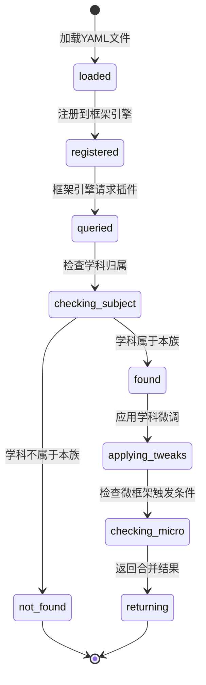

# 范式族插件 - 四层设计

## 模块内部状态

```python
from dataclasses import dataclass, field
from typing import Dict, List, Optional

@dataclass
class ParadigmFamilyPlugin:
    """范式族插件定义"""
    family_id: str                          # 如 "formal_science"
    family_name: str                        # 如 "形式科学族"
    cognitive_paradigm: str                  # 如 "逻辑推导+实验验证"
    applicable_subjects: List[str]           # 如 ["math", "physics", "chemistry"]
    
    # 各维度的范式族规则
    dimension_rules: Dict[str, dict]         # dimension_name → rule_override
    
    # 学科微调
    subject_tweaks: Dict[str, dict]          # subject → tweak_data
    
    # 微框架
    micro_frameworks: List[dict]             # 如 4W时间锚框架

@dataclass
class SubjectTweak:
    """学科微调"""
    subject: str
    dimension_overrides: Dict[str, dict]     # dimension_name → override
    extra_constraints: List[str]             # 额外约束
    micro_frameworks: List[dict]             # 学科特有微框架

@dataclass
class MicroFramework:
    """微框架定义（如4W时间锚框架）"""
    name: str                                # 如 "4W时间锚"
    trigger_condition: str                   # 触发条件（如"涉及历史背景时"）
    dimensions: List[dict]                   # 微框架维度
    grade_rules: Dict[int, dict]             # 学段规则
```

## 四层基础设施

| 层面 | 设计内容 |
|-----|---------|
| **数据规矩** | `ParadigmFamilyPlugin` 定义范式族插件结构；`SubjectTweak` 定义学科微调结构；`MicroFramework` 定义微框架结构；触发条件用字符串表达式 |
| **数据存储** | 范式族插件存储为 YAML 文件（`plugins/{family_id}.yaml`）；学科微调内嵌在范式族插件文件中；微框架内嵌在范式族插件文件中 |
| **数据流转** | 加载YAML → 解析为Python对象 → 注册到框架引擎 → 按需合并；触发条件在内容生成阶段评估 |
| **接口层** | `ParadigmPluginService` Protocol（见下方） |

## 对外接口契约

```python
from typing import Protocol, List, Optional

class ParadigmPluginService(Protocol):
    """范式族插件对外接口"""
    
    def get_plugin(self, family_id: str) -> Optional[ParadigmFamilyPlugin]:
        """获取范式族插件"""
        ...
    
    def get_plugin_for_subject(self, subject: str) -> Optional[ParadigmFamilyPlugin]:
        """根据学科获取对应的范式族插件"""
        ...
    
    def list_families(self) -> List[dict]:
        """列出所有范式族"""
        ...
    
    def get_subject_tweak(self, subject: str) -> Optional[SubjectTweak]:
        """获取学科微调"""
        ...
    
    def get_micro_frameworks(self, subject: str, context: str) -> List[MicroFramework]:
        """获取适用的微框架"""
        ...
```

## 三个范式族插件的完整定义

### 族1：形式科学族（formal_science）

```yaml
family_id: formal_science
family_name: 形式科学族
cognitive_paradigm: "逻辑推导+实验验证"
applicable_subjects: [math, physics, chemistry]

dimension_rules:
  definition:
    essential_question: "它是什么？"
    cognitive_goal: "用可操作的对象锚定概念边界"
    rules:
      - "必须用生活物品或可操作的对象锚定概念"
      - "禁止纯符号定义，必须有生活锚点"
      - "定义必须包含：概念名称 + 生活锚点 + 概念边界"
    constraints:
      - "禁止只有公式没有解释"
      - "禁止只有术语没有生活类比"
    example: "1千克 ≈ 2瓶500ml矿泉水的重量，是国际通用的质量单位"

  origin:
    essential_question: "它从哪来？"
    cognitive_goal: "理解知识不是凭空产生的，看到发现的逻辑链条"
    rules:
      - "讲关键发现节点，包含人物、困境、突破"
      - "3-5句话讲一个具体场景故事"
      - "必须包含：谁 + 遇到什么困难 + 怎么突破"
    constraints:
      - "禁止只有年代和名字没有故事"
      - "故事必须有具体细节，不能只有抽象描述"
    example: "1795年法国为统一度量衡，规定4℃时1立方分米纯水的质量为1千克"

  contradiction:
    essential_question: "为什么需要它？"
    cognitive_goal: "感受到'没有它会怎样'的逻辑困境"
    rules:
      - "对比旧经验，展示'没有这个概念会怎样'"
      - "必须有一个'困境时刻'——学习者能感受到的困难"
      - "困境必须是真实的，不是编造的"
    constraints:
      - "禁止没有困境直接给答案"
      - "困境必须与学习者的日常经验相关"
    example: "只有正数时，'3减5'算不了——但现实中欠钱是真实存在的"

  application:
    essential_question: "它能做什么？"
    cognitive_goal: "看到知识的实际价值，从抽象回到具象"
    rules:
      - "至少3个不同领域的例子"
      - "至少1个可动手验证"
      - "例子必须与学习者生活相关"
    constraints:
      - "禁止只有抽象应用没有具体场景"
    example: "超市看洗衣粉包装'2kg'；回家称1千克苹果数数有几个"

  extension:
    essential_question: "它还能怎样？"
    cognitive_goal: "拓展认知边界，链接更深层概念"
    rules:
      - "必须链接到至少1个后续知识点"
      - "提出1个进阶问题，引发思考"
    constraints:
      - "禁止只有结论没有问题"
    example: "1千克=1000克，比千克大的是吨，1吨=1000千克"

  network:
    essential_question: "它和什么关联？"
    cognitive_goal: "在知识地图上定位，看到知识不是孤立的"
    rules:
      - "前导知识点至少1个"
      - "后续知识点至少1个"
      - "标注关联类型（前导/后续/平行/跨学科）"
    constraints:
      - "禁止孤立的知识点"
    example: "前导：数数、大小比较；后续：克和吨的认识、重量计算"

  validation:
    essential_question: "真的懂了吗？"
    cognitive_goal: "用本质理解型题目检验，区分理解和记忆"
    rules:
      - "至少3题：1辨析+1实践+1选择"
      - "不考计算考理解"
      - "题目必须能区分'记住结论'和'真正理解'"
    constraints:
      - "禁止纯计算题"
      - "禁止只需记忆不需理解的题目"
    example: "妈妈说'西瓜重5千克'，爸爸说'西瓜重5米'，谁对？为什么？"

subject_tweaks:
  math:
    dimension_overrides:
      origin:
        rules_append:
          - "溯源重点讲公理→定理的逻辑链条"
          - "数学发现的故事要突出'逻辑上的不可能'如何被突破"
      contradiction:
        rules_append:
          - "矛盾必须是逻辑上的困境，不是生活上的不便"
      validation:
        rules_append:
          - "辨析题重点区分概念边界（如'千克是重量还是质量'）"
  
  physics:
    dimension_overrides:
      origin:
        rules_append:
          - "溯源重点讲假设→实验→定律的验证链条"
          - "必须提到关键实验，不能只有理论推导"
      contradiction:
        rules_append:
          - "矛盾必须是直觉与实验结果的冲突"
      application:
        rules_append:
          - "至少1个可观察的物理现象"
      validation:
        rules_append:
          - "至少1题需要设计简单实验验证"
  
  chemistry:
    dimension_overrides:
      origin:
        rules_append:
          - "溯源重点讲观察→假设→验证的发现过程"
          - "必须提到物质变化的可观察现象"
      contradiction:
        rules_append:
          - "矛盾必须是宏观现象与微观本质的差距"
      validation:
        rules_append:
          - "实验相关题目必须包含安全提示"
    extra_constraints:
      - "涉及实验的内容必须包含安全提示"

micro_frameworks:
  - name: "单位换算框架"
    trigger_condition: "知识点涉及物理/化学单位"
    dimensions:
      - "基准单位是什么"
      - "换算关系是什么"
      - "为什么需要这个单位"
      - "生活中什么物品大约是这个量级"
```

### 族2：人文学科族（humanities）

```yaml
family_id: humanities
family_name: 人文学科族
cognitive_paradigm: "情感体验+时空定位"
applicable_subjects: [chinese, history, english]

dimension_rules:
  definition:
    essential_question: "它是什么？"
    cognitive_goal: "用可体验的感受锚定概念"
    rules:
      - "必须用情感共鸣或可体验的感受锚定概念"
      - "禁止纯学术定义，必须有体验锚点"
      - "定义必须包含：概念名称 + 体验锚点 + 概念边界"
    constraints:
      - "禁止只有术语没有感受"
    example: "'以乐景衬哀情'——用春天的美好反衬内心的悲伤，越美好越显得悲伤"

  origin:
    essential_question: "它从哪来？"
    cognitive_goal: "理解创作者的生命处境，看到作品是生命的投射"
    rules:
      - "讲创作者的生命处境+时代背景"
      - "必须包含4W时间锚框架（When/Who/What/Why）"
      - "3-5句话讲一个具体场景，让学习者代入"
    constraints:
      - "禁止只有年代和事件没有人的处境"
      - "历史背景必须有时间锚点"
    example: "安史之乱后，杜甫被困长安，亲眼见城池沦陷，借草木生长暗示山河依旧人事已非"

  contradiction:
    essential_question: "为什么需要它？"
    cognitive_goal: "感受到'没有这个表达会怎样'的表达困境"
    rules:
      - "展示'没有这个表达方式会怎样'的困境"
      - "困境必须是表达上的，不是逻辑上的"
      - "必须让学习者感受到'想说但说不出来'的张力"
    constraints:
      - "禁止只有逻辑推导没有情感张力"
    example: "杜甫如果直接说'我很伤心'，读者无法感受到那种山河依旧人事已非的悲痛深度"

  application:
    essential_question: "它能做什么？"
    cognitive_goal: "看到表达方式的可迁移性，从一篇作品到生活表达"
    rules:
      - "至少3个不同场景的迁移应用"
      - "至少1个可动手练习（仿写/改写/角色扮演）"
      - "场景必须与学习者生活相关"
    constraints:
      - "禁止只有文学分析没有生活迁移"
    example: "写地震后的家乡：'樱花开满巷，不见卖糖人'，用樱花的美反衬家乡的冷清"

  extension:
    essential_question: "它还能怎样？"
    cognitive_goal: "拓展表达边界，链接更深层的手法"
    rules:
      - "必须链接到至少1个后续手法/概念"
      - "提出1个改写/对比问题，引发思考"
    constraints:
      - "禁止只有结论没有问题"
    example: "如果把'草木深'改成'草木枯'，表达效果会有什么不同？"

  network:
    essential_question: "它和什么关联？"
    cognitive_goal: "在表达谱系上定位，看到手法不是孤立的"
    rules:
      - "前导手法/概念至少1个"
      - "后续手法/概念至少1个"
      - "标注关联类型"
    constraints:
      - "禁止孤立的手法"
    example: "前导：景物描写、情感表达；后续：借景抒情、对比手法"

  validation:
    essential_question: "真的懂了吗？"
    cognitive_goal: "用体验理解型题目检验，区分感受和记忆"
    rules:
      - "至少3题：1感受辨析+1仿写/改写+1选择"
      - "不考背诵考感受"
      - "题目必须能区分'记住分析'和'真正感受到'"
    constraints:
      - "禁止纯背诵题"
      - "禁止只需记忆不需感受的题目"
    example: "以下哪个场景用了'以乐景衬哀情'？A.秋天落叶感到悲伤 B.春天花开却感到孤独 C.下雨天感到忧郁"

subject_tweaks:
  chinese:
    dimension_overrides:
      origin:
        rules_append:
          - "古诗必须嵌入历史背景（含4W时间锚）+ 作者处境"
          - "作者处境要讲'他当时在做什么、遭遇了什么'"
  
  history:
    dimension_overrides:
      origin:
        rules_append:
          - "必须包含4W时间锚框架的完整展开"
          - "因果链条必须清晰：A导致B，B导致C"
      contradiction:
        rules_append:
          - "矛盾必须是历史的必然与偶然之争"
      validation:
        rules_append:
          - "至少1题需要因果推理"
  
  english:
    dimension_overrides:
      origin:
        rules_append:
          - "溯源讲语言使用的真实场景，不是语法规则的历史"
          - "必须包含母语对比：英语为什么这样表达，中文为什么不这样表达"
      contradiction:
        rules_append:
          - "矛盾必须是母语思维的干扰——'中文不会这样说，但英语必须这样说'"
      application:
        rules_append:
          - "至少1个角色扮演场景"
      validation:
        rules_append:
          - "至少1题是交际选择——在具体语境中选择正确的表达"
    extra_constraints:
      - "所有英语例子必须包含中文翻译和母语思维对比"

micro_frameworks:
  - name: "4W时间锚框架"
    trigger_condition: "知识点涉及历史背景时"
    dimensions:
      - name: "When"
        description: "时间锚点"
        low_grade: "用代际比喻：'比你爷爷的爷爷还老'"
        mid_grade: "用'XX年前'+简单历史坐标"
        junior: "年份+历史时期+历史意义"
        senior: "年份+历史坐标+思想史定位"
      - name: "Who"
        description: "关键人物"
        low_grade: "用简单称呼：'两个坏人'"
        mid_grade: "用身份+名字：'节度使安禄山'"
        junior: "用完整身份+行为：'节度使安禄山发动叛乱'"
        senior: "用历史角色+动机分析"
      - name: "What"
        description: "发生了什么"
        low_grade: "用生活比喻：'像家里闯进了强盗'"
        mid_grade: "用简化叙事：'唐朝的安稳被打破了'"
        junior: "用历史叙事：'中央权威崩溃，战乱持续8年'"
        senior: "用多角度叙事：'政治/经济/文化层面的影响'"
      - name: "Why"
        description: "和知识点的关系"
        low_grade: "用直接关联：'杜甫就在被抢过的家里写诗'"
        mid_grade: "用逻辑关联：'战乱让杜甫有了这种感受'"
        junior: "用因果关联：'战乱经历塑造了杜甫的诗歌风格'"
        senior: "用深层关联：'时代创伤如何转化为文学表达'"
```

### 族3：生命科学族（life_science）

```yaml
family_id: life_science
family_name: 生命科学族
cognitive_paradigm: "系统观察+进化适应"
applicable_subjects: [biology, geography]

dimension_rules:
  definition:
    essential_question: "它是什么？"
    cognitive_goal: "用可观察的生命/自然现象锚定概念"
    rules:
      - "必须用可观察的现象锚定概念"
      - "从结构→功能或位置→特征的角度定义"
      - "定义必须包含：概念名称 + 可观察现象 + 功能/特征"
    constraints:
      - "禁止只有术语没有可观察现象"
    example: "光合作用是植物用阳光把水和二氧化碳变成养分的过程，就像植物在'做饭'"

  origin:
    essential_question: "它从哪来？"
    cognitive_goal: "理解发现者的观察过程，看到科学发现从观察开始"
    rules:
      - "讲发现者的观察过程：看到了什么→想到了什么→怎么验证"
      - "3-5句话讲一个观察故事"
    constraints:
      - "禁止只有结论没有观察过程"
    example: "范·海尔蒙特把柳树种在盆里，5年后柳树长重了74kg但土只少了57g，他发现植物不是吃土长大的"

  contradiction:
    essential_question: "为什么需要它？"
    cognitive_goal: "感受到'表象与本质的差异'"
    rules:
      - "展示'看似A实则B'的矛盾"
      - "矛盾必须打破日常直觉"
    constraints:
      - "禁止没有矛盾直接给结论"
    example: "植物看起来是'吃土'长大的，但海尔蒙特的实验证明土几乎没少——植物主要是'吃空气和水'长大的"

  application:
    essential_question: "它能做什么？"
    cognitive_goal: "看到生命规律在身边的应用"
    rules:
      - "至少3个身边可观察的现象"
      - "至少1个可动手观察的活动"
    constraints:
      - "禁止只有实验室应用没有生活现象"
    example: "把植物放在暗处几天，叶子会变黄——因为没有阳光无法光合作用"

  extension:
    essential_question: "它还能怎样？"
    cognitive_goal: "从个体到系统，从现状到进化"
    rules:
      - "链接到系统层面或进化视角"
      - "提出1个观察/思考问题"
    example: "如果没有光合作用，地球大气会怎样？为什么"

  network:
    essential_question: "它和什么关联？"
    cognitive_goal: "在生命系统/自然系统中定位"
    rules:
      - "前导概念至少1个"
      - "后续概念至少1个"
    example: "前导：植物的结构、阳光的作用；后续：生态系统的能量流动、碳循环"

  validation:
    essential_question: "真的懂了吗？"
    cognitive_goal: "用观察理解型题目检验"
    rules:
      - "至少3题：1现象解释+1观察实践+1推理选择"
      - "不考背诵考观察和推理"
    example: "把一盆植物用黑布罩住，3天后揭开，你预测会看到什么？为什么？"

subject_tweaks:
  biology:
    dimension_overrides:
      definition:
        rules_append:
          - "定义角度：结构→功能"
      extension:
        rules_append:
          - "延伸方向：从个体到系统，从现状到进化"
  
  geography:
    dimension_overrides:
      definition:
        rules_append:
          - "定义角度：位置→特征"
      origin:
        rules_append:
          - "溯源讲探索者的发现过程"
      contradiction:
        rules_append:
          - "矛盾必须是'看似偶然实则必然'"
      extension:
        rules_append:
          - "延伸方向：从局部到全球，从静态到动态"
    extra_constraints:
      - "地理知识点必须包含空间位置信息"
```

## 状态流转图


