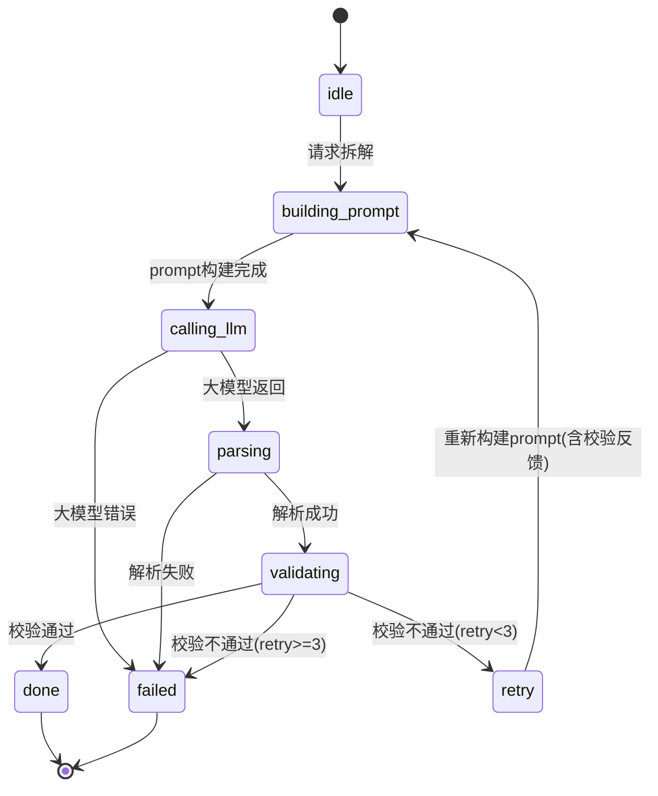

# 内容生成器 - 四层设计

## 模块内部状态

```python
from dataclasses import dataclass, field
from typing import Dict, List, Optional
from enum import Enum

class GenerationStatus(str, Enum):
    IDLE = "idle"
    BUILDING_PROMPT = "building_prompt"
    CALLING_LLM = "calling_llm"
    PARSING = "parsing"
    VALIDATING = "validating"
    DONE = "done"
    FAILED = "failed"

@dataclass
class DimensionContent:
    """单个维度的生成内容"""
    dimension_name: str
    content: str                    # 生成的内容（Markdown）
    quality_score: float            # 该维度质量评分 0-1
    issues: List[str]               # 质量问题列表

@dataclass
class DecompositionResult:
    """七维拆解结果"""
    point_id: str
    point_name: str
    subject: str
    grade: int
    paradigm_family: str
    dimensions: Dict[str, DimensionContent]
    overall_quality: float          # 整体质量评分 0-1
    generation_status: GenerationStatus
    retry_count: int = 0
    model_version: str = ""
    generated_at: str = ""

@dataclass
class ContentGeneratorState:
    """内容生成器内部状态 - 模块级单一状态源"""
    status: GenerationStatus = GenerationStatus.IDLE
    current_result: Optional[DecompositionResult] = None
    prompt_template: str = ""
    max_retries: int = 3
    quality_threshold: float = 0.7  # 质量及格线
```

## 四层基础设施

| 层面 | 设计内容 |
|-----|---------|
| **数据规矩** | `DimensionContent` 定义维度内容结构；`DecompositionResult` 定义拆解结果结构；`GenerationStatus` 枚举限制状态值；质量评分0-1浮点数 |
| **数据存储** | 拆解结果存储为 JSON 文件（`decompositions/{point_id}.json`）；prompt模板存储为 Python 字符串模板；质量校验规则存储为代码 |
| **数据流转** | 构建prompt → 调用大模型 → 解析输出 → 质量校验 → 通过则存储/不通过则重试（最多3次）→ 全部失败则标记failed |
| **接口层** | `ContentGeneratorService` Protocol（见下方） |

## 对外接口契约

```python
from typing import Protocol, Optional

class ContentGeneratorService(Protocol):
    """内容生成器对外接口"""
    
    def decompose(
        self, 
        point_id: str, 
        point_name: str,
        subject: str, 
        grade: int,
        merged_framework: dict
    ) -> DecompositionResult:
        """拆解一个知识点（核心接口）"""
        ...
    
    def get_result(self, point_id: str) -> Optional[DecompositionResult]:
        """获取已生成的拆解结果"""
        ...
    
    def regenerate_dimension(
        self, 
        point_id: str, 
        dimension_name: str
    ) -> DimensionContent:
        """重新生成单个维度的内容"""
        ...
```

## Prompt构建规则

Prompt由三部分组成：**系统指令 + 框架约束 + 知识点信息**

```
┌─────────────────────────────────────────────┐
│  系统指令（固定）                             │
│  ├── 角色：你是一位K12知识本质拆解专家        │
│  ├── 目标：按框架约束拆解知识点              │
│  ├── 输出格式：JSON                          │
│  └── 禁止事项：禁止AI套话、禁止空洞表述       │
├─────────────────────────────────────────────┤
│  框架约束（动态，来自框架引擎）               │
│  ├── 范式族：{paradigm_family}               │
│  ├── 学段：{grade} → 学段规则                │
│  ├── 各维度规则和约束                        │
│  └── 微框架触发条件和规则                    │
├─────────────────────────────────────────────┤
│  知识点信息（动态，来自知识图谱）             │
│  ├── 知识点名称                              │
│  ├── 前导知识点（供"知识网络"维度使用）       │
│  ├── 后续知识点（供"知识网络"维度使用）       │
│  └── 跨学科关联（如有）                      │
└─────────────────────────────────────────────┘
```

## 质量校验规则

质量校验分两级：**维度级校验** + **整体级校验**

### 维度级校验

| 维度 | 校验项 | 扣分规则 |
|------|--------|---------|
| 定义锚点 | 是否有生活锚点 | 无生活锚点扣0.5 |
| 定义锚点 | 是否有概念边界 | 无概念边界扣0.3 |
| 历史溯源 | 是否有具体故事 | 无故事扣0.5 |
| 历史溯源 | 故事是否有人物和困境 | 无人物或困境扣0.3 |
| 现实矛盾 | 是否有困境时刻 | 无困境扣0.5 |
| 应用场景 | 是否有3个不同领域 | 少1个扣0.2 |
| 应用场景 | 是否有可动手验证 | 无动手验证扣0.3 |
| 思维延伸 | 是否链接后续知识点 | 无链接扣0.3 |
| 知识网络 | 是否有前导和后续 | 缺1个扣0.2 |
| 验证理解 | 是否有3题 | 少1题扣0.2 |
| 验证理解 | 是否是本质理解型 | 出现纯计算题扣0.5 |

### 整体级校验

| 校验项 | 规则 |
|--------|------|
| 维度完整性 | 7个维度必须全部有内容 |
| 认知组优先 | 认知组3维质量必须>=0.7，否则整体不通过 |
| 学段适配 | 内容表述是否符合学段规则 |
| AI套话检测 | 出现"探索""旅程""赋能"等套话扣0.3 |

### 质量评分计算

```
维度质量 = 1.0 - sum(扣分)
整体质量 = 认知组平均分 * 0.5 + 应用组平均分 * 0.3 + 验证组平均分 * 0.2
通过条件 = 整体质量 >= 0.7 AND 认知组各维度 >= 0.7
```

## 状态流转图



## 重试策略

重试时，将校验失败的具体问题反馈给大模型：

```
第1次重试：将质量校验的问题列表附加到prompt中
  "以下维度未通过质量校验，请修正：{issues}"

第2次重试：降低要求，只修正认知组维度
  "请重点修正认知组维度：{cognition_issues}"

第3次重试：只修正最关键的1个维度
  "请只修正{最差维度}：{specific_issue}"
```
