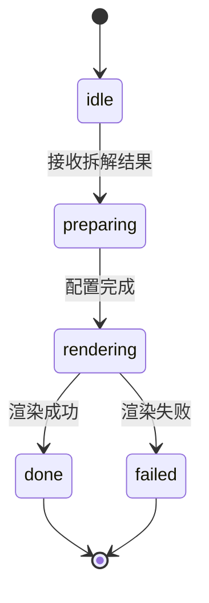

# 呈现管线 - 四层设计

## 模块内部状态

```python
from dataclasses import dataclass, field
from typing import Dict, List, Optional
from enum import Enum

class PipelineType(str, Enum):
    HTML_INTERACTIVE = "html_interactive"
    VIDEO = "video"          # 后续
    PPT = "ppt"              # 后续
    WECHAT = "wechat"        # 后续

class RenderStatus(str, Enum):
    IDLE = "idle"
    PREPARING = "preparing"
    RENDERING = "rendering"
    DONE = "done"
    FAILED = "failed"

@dataclass
class RenderConfig:
    """渲染配置"""
    pipeline_type: PipelineType
    theme: str = "dark"              # dark/light
    primary_color: str = ""          # 从内容推导
    progressive_reveal: bool = True  # 渐进式呈现
    show_knowledge_map: bool = True  # 显示知识地图

@dataclass
class PresentationState:
    """呈现管线内部状态 - 模块级单一状态源"""
    status: RenderStatus = RenderStatus.IDLE
    current_pipeline: Optional[PipelineType] = None
    config: RenderConfig = field(default_factory=lambda: RenderConfig(pipeline_type=PipelineType.HTML_INTERACTIVE))
    output_path: str = ""
```

## 四层基础设施

| 层面 | 设计内容 |
|-----|---------|
| **数据规矩** | `PipelineType` 枚举限制管线类型；`RenderConfig` 定义渲染配置；`RenderStatus` 枚举限制状态值 |
| **数据存储** | HTML输出存储为文件（`output/html/{point_id}.html`）；模板存储为 HTML 模板文件 |
| **数据流转** | 接收DecompositionResult → 选择管线 → 按模板组装 → 渲染输出 → 返回文件路径 |
| **接口层** | `PresentationService` Protocol（见下方） |

## 对外接口契约

```python
from typing import Protocol, Optional

class PresentationService(Protocol):
    """呈现管线对外接口"""
    
    def render(
        self,
        decomposition: dict,
        config: Optional[RenderConfig] = None
    ) -> str:
        """渲染拆解结果，返回输出文件路径"""
        ...
    
    def get_available_pipelines(self) -> List[dict]:
        """获取可用的管线列表"""
        ...
```

## HTML交互管线设计（MVP）

### 页面结构

```
┌─────────────────────────────────────────────────────┐
│  知本 · {知识点名称}                                │
│  {学科} · {学段}                                    │
├─────────────────────────────────────────────────────┤
│                                                     │
│  ┌─ 认知组（理解）─────────────────────────────┐    │
│  │  ① 定义锚点    [▼ 展开]                     │    │
│  │  ② 历史溯源    [▶ 收起]                     │    │
│  │  ③ 现实矛盾    [▶ 收起]                     │    │
│  └─────────────────────────────────────────────┘    │
│                                                     │
│  ┌─ 应用组（迁移）─────────────────────────────┐    │
│  │  ④ 应用场景    [▶ 收起]                     │    │
│  │  ⑤ 思维延伸    [▶ 收起]                     │    │
│  │  ⑥ 知识网络    [▶ 收起]                     │    │
│  └─────────────────────────────────────────────┘    │
│                                                     │
│  ┌─ 验证组（确认）─────────────────────────────┐    │
│  │  ⑦ 验证理解    [开始答题]                   │    │
│  └─────────────────────────────────────────────┘    │
│                                                     │
│  ┌─ 知识地图 ─────────────────────────────────┐    │
│  │  {前导} → ★{当前}★ → {后续}                │    │
│  └─────────────────────────────────────────────┘    │
│                                                     │
└─────────────────────────────────────────────────────┘
```

### 交互规则

1. **渐进展开**：默认展开认知组，折叠应用组和验证组
2. **知识地图可点击**：点击关联知识点可跳转（触发新的拆解）
3. **验证题目交互**：点击"开始答题"展开题目，选择后即时反馈
4. **学段切换**：右上角可切换学段（对比不同表述）

### 设计原则

- 深色背景 + 高对比文字
- 强调色从学科推导（数学→青蓝，语文→暖金，物理→青色，历史→琥珀，生物→绿色）
- 卡片有边框
- 背景有纹理
- 禁止Emoji、禁止紫色渐变、禁止AI套话

## 状态流转图



## 本质工坊HTML管线评估与决策

### 评估结论

| 维度 | 成熟度 | 说明 |
|------|--------|------|
| 模板系统 | 成熟 | v1(滚动) + v2(分页) 两套模板，CSS变量体系完整，响应式+打印样式齐全 |
| 配色系统 | 成熟 | 原则驱动配色，深色背景+高对比文字+内容推导强调色，CSS变量化 |
| 分页交互 | 成熟 | v2模板有完整的翻页、键盘导航、触摸滑动、自动播放、进度条、侧边导航 |
| Markdown→HTML | 基础可用 | 简单正则转换，支持标题/列表/加粗/代码，不支持表格/图片 |
| 交互组件 | 按需生成 | 无预制组件，大模型按需生成HTML/CSS/JS嵌入 |
| 元素层管线 | 可用 | Python脚本从元素层读取→组装→输出单文件HTML |

### 与知本需求的差距

| 知本需求 | 本质工坊现状 | 差距 |
|---------|-------------|------|
| 折叠面板（三组渐进展开） | 无此组件 | 需要新增 |
| 知识地图（前导→当前→后续可视化导航） | 无此组件 | 需要新增 |
| 验证题目交互（选择+即时反馈+解析） | v2有quiz页型但交互简单 | 需要增强 |
| 学段切换 | 无此功能 | 需要新增 |
| 七维结构化布局 | 通用section布局 | 需要定制 |

### 决策：知本Skill自包含HTML模板

**不依赖本质工坊的管线脚本，知本Skill自带专属HTML模板。**

理由：
1. 知本的交互组件（折叠面板、知识地图、验证题目）是领域特有的，不适合放进通用管线
2. Skill模式下大模型直接生成完整HTML，无需Python脚本中转
3. 自包含意味着Skill可独立运行，不依赖外部工具

**复用部分**：
- CSS变量体系（颜色/间距/字体）
- 配色原则（深色背景+高对比+内容推导强调色）
- 单文件输出模式（所有CSS/JS内联）

**定制部分**：
- 七维布局专用CSS（三组卡片、折叠动画）
- 折叠面板组件（点击展开/收起，默认展开认知组）
- 知识地图组件（SVG节点+连线，可点击跳转）
- 验证题目组件（选择+判断+解析展开）
- 学段切换组件（标签切换，内容区域切换）

模板文件位于：`templates/decomposition.html`
