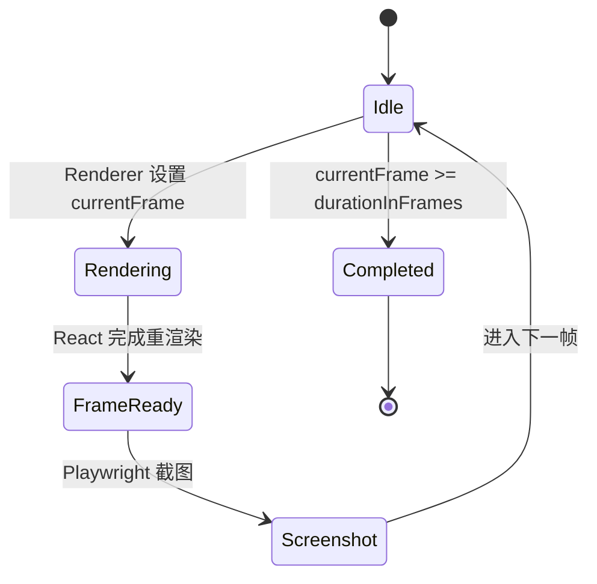

# 04 - video-core 四层设计

> 模块定位：为 Agent 提供一套轻量、狭窄、确定性的 Video DSL API，是视频代码生成管线的核心契约层。

---

## 模块内部状态

```typescript
// packages/video-core/src/types.ts

interface CompositionConfig {
  id: string;
  width: number;
  height: number;
  fps: number;
  durationInFrames: number;
}

interface SequenceContextValue {
  cumulatedFrom: number;      // 当前 Sequence 在时间轴上的绝对起始帧
  parentFrom: number;         // 父级 Sequence 的偏移，用于嵌套
}

interface TimelineContextValue {
  currentFrame: number;       // 当前全局帧号
  composition: CompositionConfig;
}

interface AssetRegistry {
  images: Set<string>;
  audio: Set<string>;
  video: Set<string>;
}
```

---

## 四层基础设施

### 数据规矩

| 数据 | 类型 | 约束 | 默认值 |
|-----|------|------|--------|
| `currentFrame` | `number` | `0 <= currentFrame < durationInFrames` | `0` |
| `cumulatedFrom` | `number` | 整数，可正可负 | `0` |
| `durationInFrames` | `number` | 正整数 | 必须显式传入 |
| `fps` | `number` | 正整数，常用 24/30/60 | `30` |
| `interpolate.input` | `number` | 任意数值 | 无 |
| `interpolate.inputRange` | `[number, number]` | 必须递增 | 无 |
| `interpolate.outputRange` | `[number, number]` | 无特殊约束 | 无 |

### 数据存储

- **全局状态**：`TimelineContext` 通过 React Context 存储当前帧和 composition 配置。
- **局部状态**：`SequenceContext` 通过 React Context 存储当前 Sequence 的帧偏移。
- **资源注册表**：`AssetRegistry` 在组件渲染时收集 `staticFile()` 调用路径，供 renderer 提前复制/校验。
- **持久化**：不持久化到磁盘；状态随渲染进程生命周期存在。

### 数据流转

```
Renderer 设置 currentFrame = n
        ↓
TimelineContext.Provider 更新 currentFrame
        ↓
React 重新渲染整棵组件树
        ↓
useCurrentFrame() 返回 n
        ↓
interpolate(n, ...) 计算样式属性
        ↓
Sequence 根据 cumulatedFrom 判断是否渲染子元素
        ↓
组件返回当前帧对应的 DOM/Canvas
        ↓
Renderer 截图
```

### 接口层

```typescript
// packages/video-core/src/index.ts

export interface CompositionProps {
  id: string;
  component: React.ComponentType;
  width: number;
  height: number;
  fps: number;
  durationInFrames: number;
  defaultProps?: Record<string, unknown>;
}

export interface SequenceProps {
  from?: number;
  durationInFrames?: number;
  children: React.ReactNode;
}

export interface AbsoluteFillProps {
  style?: React.CSSProperties;
  children?: React.ReactNode;
}

export function useCurrentFrame(): number;
export function useVideoConfig(): CompositionConfig;
export function interpolate(
  input: number,
  inputRange: readonly [number, number],
  outputRange: readonly [number, number],
  options?: {
    easing?: (t: number) => number;
    extrapolateLeft?: 'extend' | 'clamp' | 'identity';
    extrapolateRight?: 'extend' | 'clamp' | 'identity';
  }
): number;

export const Composition: React.FC<CompositionProps>;
export const Sequence: React.FC<SequenceProps>;
export const AbsoluteFill: React.FC<AbsoluteFillProps>;
export const Video: React.FC<VideoProps>;
export const Audio: React.FC<AudioProps>;
export const Img: React.FC<ImgProps>;
export function staticFile(path: string): string;
```

---

## 对外接口契约

```typescript
// 模块对外暴露的完整契约

export interface VideoCoreAPI {
  // Hooks
  useCurrentFrame: () => number;
  useVideoConfig: () => CompositionConfig;

  // 数学工具
  interpolate: (
    input: number,
    inputRange: readonly [number, number],
    outputRange: readonly [number, number],
    options?: InterpolateOptions
  ) => number;

  // 组件
  Composition: React.FC<CompositionProps>;
  Sequence: React.FC<SequenceProps>;
  AbsoluteFill: React.FC<AbsoluteFillProps>;
  Video: React.FC<VideoProps>;
  Audio: React.FC<AudioProps>;
  Img: React.FC<ImgProps>;

  // 工具
  staticFile: (path: string) => string;
}
```

**使用规则**：
- 所有动画属性必须通过 `useCurrentFrame()` + `interpolate()` 计算。
- 所有媒体资源必须通过 `staticFile()` 引用。
- 禁止使用 CSS animation、transition、`requestAnimationFrame`。
- 组件渲染结果必须仅依赖 `currentFrame` 和 `props`。

---

## 核心实现细节

### Sequence 的时间偏移

```tsx
// Sequence.tsx
export const Sequence: React.FC<SequenceProps> = ({
  from = 0,
  durationInFrames = Infinity,
  children,
}) => {
  const parent = useContext(SequenceContext);
  const cumulatedFrom = parent.cumulatedFrom + from;

  // 只在当前帧位于 Sequence 区间内时渲染
  const frame = useCurrentFrame();
  const isActive = frame >= cumulatedFrom && frame < cumulatedFrom + durationInFrames;

  if (!isActive) return null;

  return (
    <SequenceContext.Provider value={{ cumulatedFrom, parentFrom: from }}>
      {children}
    </SequenceContext.Provider>
  );
};
```

### interpolate 行为

```typescript
// interpolate.ts
export function interpolate(
  input: number,
  inputRange: readonly [number, number],
  outputRange: readonly [number, number],
  options?: InterpolateOptions
): number {
  const [inMin, inMax] = inputRange;
  const [outMin, outMax] = outputRange;

  if (inMin === inMax) return outMin;

  let t = (input - inMin) / (inMax - inMin);
  const easing = options?.easing ?? ((x) => x);

  // 默认 clamp
  const leftBehavior = options?.extrapolateLeft ?? 'clamp';
  const rightBehavior = options?.extrapolateRight ?? 'clamp';

  if (t < 0) {
    if (leftBehavior === 'clamp') t = 0;
    else if (leftBehavior === 'identity') return input;
    // extend: 继续计算
  }
  if (t > 1) {
    if (rightBehavior === 'clamp') t = 1;
    else if (rightBehavior === 'identity') return input;
  }

  return outMin + easing(t) * (outMax - outMin);
}
```

### staticFile 与资源注册

```typescript
// static-file.ts
const assetRegistry: AssetRegistry = {
  images: new Set(),
  audio: new Set(),
  video: new Set(),
};

export function staticFile(path: string): string {
  // 运行时返回相对路径
  // 渲染前由 renderer 扫描 registry
  const ext = path.split('.').pop()?.toLowerCase();
  if (['png', 'jpg', 'jpeg', 'svg', 'gif', 'webp'].includes(ext ?? '')) {
    assetRegistry.images.add(path);
  } else if (['mp3', 'wav', 'aac', 'ogg'].includes(ext ?? '')) {
    assetRegistry.audio.add(path);
  } else if (['mp4', 'mov', 'webm'].includes(ext ?? '')) {
    assetRegistry.video.add(path);
  }
  return path;
}

export function getAssetRegistry(): AssetRegistry {
  return {
    images: new Set(assetRegistry.images),
    audio: new Set(assetRegistry.audio),
    video: new Set(assetRegistry.video),
  };
}

export function clearAssetRegistry(): void {
  assetRegistry.images.clear();
  assetRegistry.audio.clear();
  assetRegistry.video.clear();
}
```

---

## 状态流转图



---

## 失败模式

| 失败场景 | 原因 | 处理动作 |
|---------|------|---------|
| `useCurrentFrame()` 在 Composition 外调用 | Context 缺失 | 抛出错误，提示必须在 Composition 内使用 |
| Sequence 的 `from` 非整数 | 数据规矩被违反 | TypeScript 类型检查 + 运行时警告 |
| `interpolate` 的 inputRange 非递增 | 数学上无意义 | 抛出错误 |
| 静态资源文件不存在 | `staticFile` 只记录路径，不校验 | renderer 阶段前置校验，缺失则报错 |
| 嵌套 Sequence 导致 currentFrame 计算错误 | cumulatedFrom 叠加错误 | 单元测试覆盖嵌套场景 |

---

## 验证契约

| 维度 | 检查项 | 验证方式 |
|-----|--------|---------|
| P | 所有 API 都有 TypeScript 类型 | `tsc --noEmit` |
| Q | 同一帧重复渲染两次，截图像素一致 | 像素 diff |
| I | 不引入 CSS animation / requestAnimationFrame | 静态扫描 + 运行时拦截 |

---

*返回总览：[[00-essence-video-generation-plan]]*
