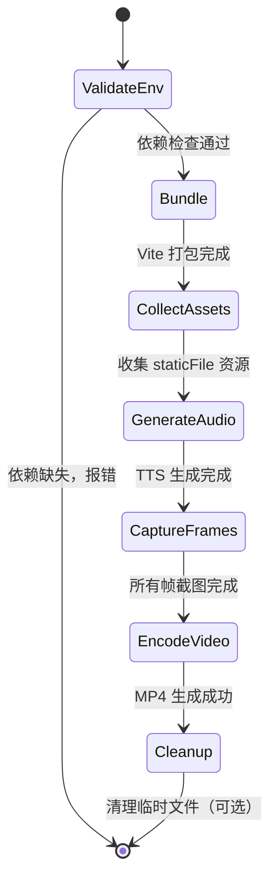

# 05 - video-renderer 四层设计

> 模块定位：把 Agent 生成的 `VideoProgram.tsx` 打包、逐帧截图、并与音频合成，最终输出 MP4/GIF。

---

## 模块内部状态

```typescript
// packages/video-renderer/src/types.ts

interface RenderJob {
  entryFile: string;           // VideoProgram.tsx 入口文件
  outputDir: string;           // 输出目录
  width: number;
  height: number;
  fps: number;
  durationInFrames: number;
  compositionId: string;
  publicDir?: string;          // 静态资源目录
}

interface RenderProgress {
  currentFrame: number;
  totalFrames: number;
  phase: 'bundle' | 'screenshot' | 'audio' | 'encode' | 'done';
}

interface RenderResult {
  videoPath: string;
  framesDir: string;
  audioPath?: string;
  durationInSeconds: number;
}
```

---

## 四层基础设施

### 数据规矩

| 数据 | 类型 | 约束 | 默认值 |
|-----|------|------|--------|
| `entryFile` | `string` | 必须是存在的 `.tsx` 文件 | 无 |
| `outputDir` | `string` | 可写目录 | 当前目录下 `output/video/` |
| `width` | `number` | 正整数 | `1080` |
| `height` | `number` | 正整数 | `1920` |
| `fps` | `number` | 正整数 | `30` |
| `durationInFrames` | `number` | 正整数 | 从 composition 中读取 |
| `deviceScaleFactor` | `number` | 1 或 2 | `2` |

### 数据存储

- **临时文件**：PNG 帧序列保存在 `outputDir/_frames/`；TTS 音频保存在 `outputDir/_audio/`。
- **日志**：渲染日志写入 `outputDir/render.log`。
- **结果文件**：最终 MP4 保存为 `outputDir/final.mp4`。
- **状态不持久化**：RenderJob 和 RenderProgress 在单次渲染进程内有效。

### 数据流转

```
输入：VideoProgram.tsx + public/
        ↓
Step 1: Vite 打包 → dist/index.html + assets
        ↓
Step 2: Playwright 启动 headless Chromium
        ↓
Step 3: 预渲染一帧，收集 assetRegistry
        ↓
Step 4: 生成 TTS 旁白（如需要）
        ↓
Step 5: 循环 frame = 0 .. N-1
        ├── 通过 window.__essence_setFrame(n) 设置当前帧
        ├── 等待 React 渲染完成
        └── Playwright 截图 → frame_0000.png
        ↓
Step 6: FFmpeg 合并 PNG 序列 + 音频 → final.mp4
        ↓
输出：final.mp4 + 中间文件
```

### 接口层

```typescript
// packages/video-renderer/src/index.ts

export interface RenderOptions {
  entryFile: string;
  outputDir?: string;
  publicDir?: string;
  width?: number;
  height?: number;
  fps?: number;
  deviceScaleFactor?: number;
  format?: 'mp4' | 'gif';
  onProgress?: (progress: RenderProgress) => void;
}

export async function renderVideo(options: RenderOptions): Promise<RenderResult>;
export function findFfmpeg(): string | null;
export function findChrome(): string | null;
```

**CLI 接口**：

```bash
npx essence-render src/VideoProgram.tsx --output output/video/ --fps 30
```

---

## 对外接口契约

```typescript
export interface VideoRendererAPI {
  renderVideo: (options: RenderOptions) => Promise<RenderResult>;
}
```

**调用规则**：
- `entryFile` 必须导出一个包含 `<Composition>` 的 React 组件。
- `outputDir` 不存在会自动创建。
- 渲染完成后，中间文件（PNG 序列、TTS 音频）默认保留，可配置清理。
- 渲染过程中可通过 `onProgress` 回调获取进度。

---

## 核心实现细节

### 1. Vite 打包

```typescript
// renderer.ts
import { build } from 'vite';
import react from '@vitejs/plugin-react';
import path from 'path';

async function bundleEntry(entryFile: string, outputDir: string) {
  const bundleDir = path.join(outputDir, '_bundle');
  await build({
    root: path.dirname(entryFile),
    build: {
      outDir: bundleDir,
      emptyOutDir: true,
      rollupOptions: {
        input: entryFile,
      },
    },
    plugins: [react()],
  });
  return path.join(bundleDir, 'index.html');
}
```

### 2. 页面与帧控制

在打包后的页面中注入全局帧控制脚本：

```typescript
// 运行时注入到页面
await page.addInitScript(() => {
  (window as any).__essence_state = {
    currentFrame: 0,
    listeners: new Set(),
  };

  (window as any).__essence_setFrame = (frame: number) => {
    (window as any).__essence_state.currentFrame = frame;
    (window as any).__essence_state.listeners.forEach((fn: Function) => fn(frame));
  };

  (window as any).__essence_subscribe = (fn: Function) => {
    (window as any).__essence_state.listeners.add(fn);
  };
});
```

`video-core` 中的 `useCurrentFrame()` 需要能读取这个全局状态：

```typescript
// use-current-frame.ts（video-core 内部）
export function useCurrentFrame(): number {
  const [frame, setFrame] = useState(0);

  useEffect(() => {
    if (typeof window !== 'undefined' && (window as any).__essence_subscribe) {
      (window as any).__essence_subscribe(setFrame);
    }
  }, []);

  return frame;
}
```

### 3. 逐帧截图

```typescript
async function captureFrames(
  page: Page,
  durationInFrames: number,
  framesDir: string,
  onProgress?: (p: RenderProgress) => void
) {
  for (let frame = 0; frame < durationInFrames; frame++) {
    await page.evaluate((f) => (window as any).__essence_setFrame(f), frame);
    // 等待 React 渲染 + 字体/图片加载
    await page.waitForTimeout(50);
    await page.waitForLoadState('networkidle');

    const padded = String(frame).padStart(5, '0');
    await page.screenshot({
      path: path.join(framesDir, `frame_${padded}.png`),
      type: 'png',
    });

    onProgress?.({
      currentFrame: frame,
      totalFrames: durationInFrames,
      phase: 'screenshot',
    });
  }
}
```

### 4. FFmpeg 合成

```typescript
function encodeVideo(
  framesDir: string,
  audioPath: string | undefined,
  outputPath: string,
  fps: number
) {
  const framePattern = path.join(framesDir, 'frame_%05d.png');

  const args = [
    '-y',
    '-framerate', String(fps),
    '-i', framePattern,
  ];

  if (audioPath) {
    args.push('-i', audioPath);
    args.push('-c:a', 'aac', '-b:a', '128k', '-shortest');
  }

  args.push(
    '-c:v', 'libx264',
    '-pix_fmt', 'yuv420p',
    '-preset', 'medium',
    '-crf', '20',
    '-movflags', '+faststart',
    outputPath
  );

  return spawnSync(FFMPEG, args, { stdio: 'inherit' });
}
```

---

## 状态流转图



---

## 失败模式

| 失败场景 | 原因 | 处理动作 |
|---------|------|---------|
| FFmpeg 未安装 | 环境缺失 | 前置检查报错，输出安装指南 |
| Chrome 未安装 | Playwright 依赖缺失 | 提示运行 `npx playwright install chromium` |
| Vite 打包失败 | Agent 代码语法/类型错误 | 返回编译错误给 Agent，要求修复 |
| 截图超时 | 页面资源过大或脚本死循环 | 设置单帧超时，失败则跳过并记录 |
| 帧序列不连续 | 截图过程中断 | 校验 PNG 文件数量，缺失则重试 |
| FFmpeg 合成失败 | 音频采样率/编码不兼容 | 先重编码音频再合并 |
| 输出文件为空 | 渲染零帧或编码异常 | 校验文件大小 > 0 |

---

## 验证契约

| 维度 | 检查项 | 验证方式 |
|-----|--------|---------|
| P | Node.js、Chrome、FFmpeg 可用 | 脚本前置检查 |
| Q | 输出 MP4 时长 = durationInFrames / fps | ffprobe 检测 |
| Q | 输出 MP4 分辨率 = width × height | ffprobe 检测 |
| I | 不修改用户源码 | 输出目录与源码目录隔离 |

---

*返回总览：[[00-essence-video-generation-plan]]*
