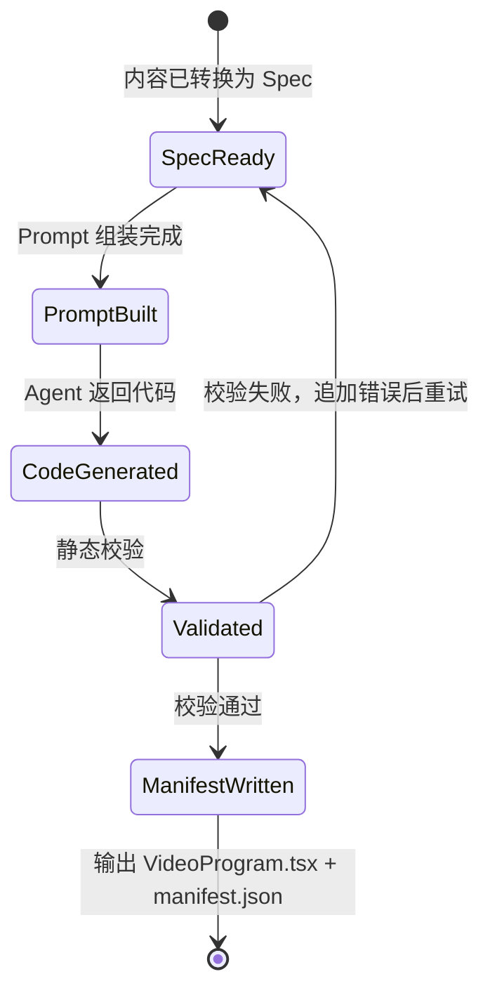

# 06 - video-generator 四层设计

> 模块定位：把本质工坊提炼出的结构化内容，转换为符合 Video DSL 契约的 `VideoProgram.tsx`，并确保 Agent 输出可被 renderer 编译和渲染。

---

## 模块内部状态

```typescript
// packages/video-generator/src/types.ts

interface VideoGenerationSpec {
  title: string;
  aspectRatio: '9:16' | '16:9' | '1:1';
  durationSeconds: number;
  fps: number;
  style?: string;
  sections: VideoSection[];
  assets?: {
    bgm?: string;
    images?: string[];
    videos?: string[];
  };
}

interface VideoSection {
  type: 'title' | 'scene' | 'summary' | 'stat' | 'compare' | 'timeline';
  heading?: string;
  subheading?: string;
  content?: string;
  visualHint?: string;
  durationFrames: number;
  narration?: string;
  data?: Record<string, unknown>;
}

interface GenerationResult {
  videoProgramPath: string;
  manifestPath: string;
  specPath: string;
  assets: string[];
}

interface ValidationReport {
  valid: boolean;
  errors: string[];
  warnings: string[];
}
```

---

## 四层基础设施

### 数据规矩

| 数据 | 类型 | 约束 | 默认值 |
|-----|------|------|--------|
| `title` | `string` | 非空，≤ 60 字 | 无 |
| `aspectRatio` | `'9:16' \| '16:9' \| '1:1'` | 三选一 | `'9:16'` |
| `durationSeconds` | `number` | 正数，MVP ≤ 90 | 无 |
| `fps` | `number` | 正整数 | `30` |
| `sections` | `VideoSection[]` | 非空 | 无 |
| `durationFrames` | `number` | 正整数，sum(sections) = durationSeconds × fps | 无 |
| `narration` | `string` | 每句 ≤ 30 字，适合 TTS | 可选 |

### 数据存储

- **输入文件**：`outputDir/spec.json`，保存原始 `VideoGenerationSpec`。
- **生成代码**：`outputDir/VideoProgram.tsx`，Agent 生成的视频代码。
- **清单文件**：`outputDir/manifest.json`，记录 composition 元数据和资源清单。
- **Prompt 模板**：`templates/prompt-template.md`，作为 Agent 调用的系统提示。
- **校验缓存**：不持久化；每次生成重新校验。

### 数据流转

```
本质工坊 A/B/C/D 输出内容
        ↓
内容转换器 → VideoGenerationSpec
        ↓
Prompt Builder → 组装 Agent Prompt
        ↓
Agent（任意 LLM）→ 生成 VideoProgram.tsx
        ↓
静态校验器 → TypeScript 编译检查
        ↓
DSL 契约校验器 → 检查 CSS animation / requestAnimationFrame
        ↓
Renderer 调用入口 → 渲染视频
```

### 接口层

```typescript
// packages/video-generator/src/index.ts

export interface GenerateOptions {
  spec: VideoGenerationSpec;
  outputDir: string;
  agentClient: AgentClient;        // 任意 Agent 客户端
  promptTemplate?: string;         // 可选自定义 Prompt
  maxRetries?: number;             // 默认 3
}

export interface AgentClient {
  generateCode: (prompt: string) => Promise<string>;
}

export async function generateVideoProgram(
  options: GenerateOptions
): Promise<GenerationResult>;

export function validateVideoProgram(
  code: string,
  spec: VideoGenerationSpec
): ValidationReport;

export function buildPrompt(
  spec: VideoGenerationSpec,
  template: string
): string;
```

---

## 对外接口契约

```typescript
export interface VideoGeneratorAPI {
  generateVideoProgram: (options: GenerateOptions) => Promise<GenerationResult>;
  validateVideoProgram: (code: string, spec: VideoGenerationSpec) => ValidationReport;
  buildPrompt: (spec: VideoGenerationSpec, template: string) => string;
}
```

**调用规则**：
- `agentClient.generateCode()` 必须返回完整的 `.tsx` 文件内容。
- 生成的代码必须能通过 `validateVideoProgram()` 的静态检查。
- 校验失败时，模块会自动将错误信息追加到 Prompt，要求 Agent 重试（最多 `maxRetries` 次）。
- 成功输出包含代码路径、清单路径和资源清单。

---

## 核心实现细节

### 1. Prompt 模板

```markdown
# Role
你是一名 Essence Video DSL 程序员。请根据输入的 VideoGenerationSpec，
生成一个 TypeScript React 组件文件 VideoProgram.tsx。

# 必须遵守的规则
1. 所有动画必须基于 `useCurrentFrame()` 返回的 frame 计算。
2. 使用 `interpolate(frame, [start, end], [from, to])` 计算数值属性。
3. 使用 `<Sequence from={...} durationInFrames={...}>` 控制元素出现时间。
4. 使用 `<AbsoluteFill>` 作为根布局容器。
5. 媒体文件必须使用 `staticFile('relative/path')` 引用。
6. 禁止使用 CSS animation、transition、requestAnimationFrame。
7. 所有视觉变化必须能从 frame 推导，保证渲染确定性。
8. 组件名称必须导出为 `VideoProgram`。

# 输出格式
只输出完整的 TypeScript 代码，不要解释，不要 markdown 代码块标记。

# VideoGenerationSpec
{{spec_json}}

# 尺寸信息
- 宽度：{{width}} 像素
- 高度：{{height}} 像素
- 帧率：{{fps}} fps
- 总帧数：{{durationInFrames}}
```

### 2. 内容转换器（本质工坊 → Spec）

```typescript
// content-to-spec.ts
export function contentToSpec(
  content: EssenceContent,      // 来自本质工坊的知识笔记/拆解结果
  options: Partial<VideoGenerationSpec> = {}
): VideoGenerationSpec {
  const durationSeconds = options.durationSeconds ?? 60;
  const fps = options.fps ?? 30;

  return {
    title: content.title,
    aspectRatio: options.aspectRatio ?? '9:16',
    durationSeconds,
    fps,
    sections: content.sections.map((sec, idx) => ({
      type: inferSectionType(sec),
      heading: sec.heading,
      content: sec.summary,
      visualHint: sec.visualHint,
      durationFrames: Math.round((sec.durationRatio ?? 1 / content.sections.length) * durationSeconds * fps),
      narration: sec.narration,
    })),
  };
}
```

### 3. 校验器

```typescript
// validator.ts
export function validateVideoProgram(code: string, spec: VideoGenerationSpec): ValidationReport {
  const errors: string[] = [];
  const warnings: string[] = [];

  // 1. 必须包含 Composition
  if (!/Composition\s*[/=]?\s*</.test(code) && !code.includes('<Composition')) {
    errors.push('缺少 <Composition> 组件');
  }

  // 2. 禁止使用 CSS animation / transition
  if (/animation\s*:/.test(code) || /transition\s*:/.test(code)) {
    errors.push('禁止使用 CSS animation / transition');
  }

  // 3. 禁止 requestAnimationFrame / setInterval
  if (/requestAnimationFrame\s*\(/.test(code) || /setInterval\s*\(/.test(code)) {
    errors.push('禁止使用 requestAnimationFrame / setInterval');
  }

  // 4. 必须使用 useCurrentFrame
  if (!code.includes('useCurrentFrame')) {
    warnings.push('未检测到 useCurrentFrame，可能缺少动画');
  }

  // 5. 资源引用必须使用 staticFile
  const srcMatches = code.match(/src\s*=\s*["']([^"']+)["']/g) || [];
  for (const src of srcMatches) {
    if (!src.includes('staticFile(')) {
      warnings.push(`媒体资源建议通过 staticFile 引用：${src}`);
    }
  }

  // 6. 导出名检查
  if (!code.includes('export const VideoProgram')) {
    errors.push('必须导出 VideoProgram 组件');
  }

  return { valid: errors.length === 0, errors, warnings };
}
```

### 4. 重试循环

```typescript
async function generateWithRetry(
  prompt: string,
  agentClient: AgentClient,
  spec: VideoGenerationSpec,
  maxRetries = 3
): Promise<string> {
  let currentPrompt = prompt;

  for (let attempt = 0; attempt <= maxRetries; attempt++) {
    const code = await agentClient.generateCode(currentPrompt);
    const report = validateVideoProgram(code, spec);

    if (report.valid) return code;
    if (attempt === maxRetries) {
      throw new Error(`生成失败，超过最大重试次数：\n${report.errors.join('\n')}`);
    }

    currentPrompt = `${currentPrompt}\n\n# 上次生成的问题（请修复）\n${report.errors.map(e => `- ${e}`).join('\n')}`;
  }

  throw new Error('Unexpected');
}
```

---

## 状态流转图



---

## 失败模式

| 失败场景 | 原因 | 处理动作 |
|---------|------|---------|
| Agent 输出非代码 | 模型未遵循格式 | 提示中增加输出格式示例，重试 |
| 代码缺少 Composition | 模型遗漏根组件 | 校验失败，追加错误信息重试 |
| 使用 CSS animation | 模型未遵守契约 | 静态扫描拦截，提示改用 frame 驱动 |
| 使用 requestAnimationFrame | 模型引入非确定性 | 静态扫描拦截 |
| durationFrames 总和错误 | 模型计算错误 | 校验 sum(sections.durationFrames) == totalFrames |
| 静态资源路径错误 | 模型写错路径 | renderer 阶段校验文件存在性 |
| 超过重试次数 | 模型持续无法生成合法代码 | 抛出错误，转人工或降级到 HTML 录制管线 |

---

## Agent 无关性设计

| 维度 | 设计 |
|-----|------|
| 输入 | 标准 JSON Schema：`VideoGenerationSpec` |
| 输出 | 标准文件：`VideoProgram.tsx` |
| Prompt | 模板化，任何 LLM Agent 都可使用 |
| 客户端 | `AgentClient` 接口，可接入 OpenAI、DeepSeek、Kimi、本地模型等 |
| 校验 | 不依赖模型，纯静态扫描 + TypeScript 编译 |

---

## 验证契约

| 维度 | 检查项 | 验证方式 |
|-----|--------|---------|
| P | AgentClient 可调用 | mock 客户端测试 |
| Q | 输出代码通过 TypeScript 编译 | `tsc --noEmit` |
| Q | 输出代码通过 DSL 契约校验 | `validateVideoProgram()` |
| I | Prompt 模板变更不破坏旧 Spec | Schema 向后兼容测试 |

---

*返回总览：[[00-essence-video-generation-plan]]*
