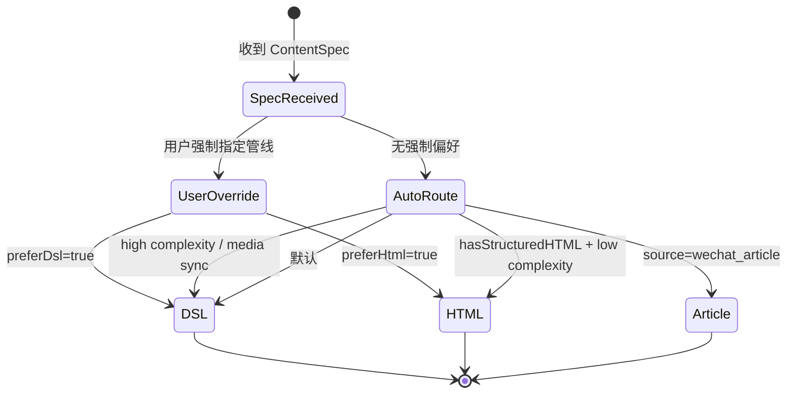

# 07 - pipeline-router 四层设计

> 模块定位：根据内容特征、环境条件、用户意图，在本质工坊的多个视频生成管线之间做路由选择，确保每种内容都走最合适的生产路径。

---

## 模块内部状态

```typescript
// packages/pipeline-router/src/types.ts

interface ContentSpec {
  source?: 'knowledge' | 'wechat_article' | 'project_analysis' | 'user_input';
  hasStructuredHTML?: boolean;
  htmlPath?: string;
  articleUrl?: string;
  visualComplexity?: 'low' | 'medium' | 'high';
  hasAnimationRequirements?: boolean;
  hasMediaSync?: boolean;          // 是否需要音画精确同步
  durationSeconds?: number;
  sections?: Array<{ type: string; narration?: string }>;
}

interface RouterDecision {
  pipeline: 'dsl' | 'html_record' | 'article_to_video';
  reason: string;
  confidence: 'high' | 'medium' | 'low';
  fallback?: 'dsl' | 'html_record' | 'article_to_video';
}

interface RouterConfig {
  preferDsl?: boolean;
  maxHtmlRecordDuration?: number;     // HTML 滚动录制适合的最大时长
  enableFallback?: boolean;
}
```

---

## 四层基础设施

### 数据规矩

| 数据 | 类型 | 约束 | 默认值 |
|-----|------|------|--------|
| `source` | `string` | 枚举值 | `'user_input'` |
| `hasStructuredHTML` | `boolean` | - | `false` |
| `visualComplexity` | `'low' \| 'medium' \| 'high'` | 三选一 | `'medium'` |
| `hasAnimationRequirements` | `boolean` | - | `false` |
| `hasMediaSync` | `boolean` | - | `false` |
| `durationSeconds` | `number` | 正数 | `60` |
| `preferDsl` | `boolean` | - | `false` |

### 数据存储

- **配置**：`config/router.json`，用户可覆盖默认路由策略。
- **决策日志**：每次路由选择写入 `outputDir/router-decision.json`，便于审计和调优。
- **状态**：单次路由调用无持久状态。

### 数据流转

```
本质工坊内容输出阶段
        ↓
内容特征提取器 → ContentSpec
        ↓
Pipeline Router → RouterDecision
        ↓
分发到具体管线：
  ├── dsl_video_pipeline.py
  ├── html_to_video.py
  └── article_to_video.py
        ↓
输出 MP4
```

### 接口层

```typescript
// packages/pipeline-router/src/index.ts

export interface RouteOptions {
  contentSpec: ContentSpec;
  config?: RouterConfig;
}

export function selectPipeline(options: RouteOptions): RouterDecision;
export function explainDecision(decision: RouterDecision): string;
```

---

## 对外接口契约

```typescript
export interface PipelineRouterAPI {
  selectPipeline: (options: RouteOptions) => RouterDecision;
  explainDecision: (decision: RouterDecision) => string;
}
```

**调用规则**：
- `selectPipeline` 只负责决策，不执行渲染。
- 当 `confidence === 'low'` 时，必须返回 `fallback` 分支。
- 用户可通过 `preferDsl: true` 强制走 DSL 管线。
- 决策结果必须可解释（`reason` 字段）。

---

## 核心实现细节

### 路由决策表

```typescript
export function selectPipeline(options: RouteOptions): RouterDecision {
  const { contentSpec, config = {} } = options;

  // 用户强制偏好
  if (config.preferDsl) {
    return {
      pipeline: 'dsl',
      reason: '用户显式选择 DSL 管线',
      confidence: 'high',
    };
  }

  // 公众号文章源 → 文章转视频
  if (contentSpec.source === 'wechat_article') {
    return {
      pipeline: 'article_to_video',
      reason: '来源是公众号文章，使用 slides 模板转视频',
      confidence: 'high',
      fallback: 'html_record',
    };
  }

  // 有高质量 HTML 且动画需求低 → HTML 滚动录制
  if (contentSpec.hasStructuredHTML &&
      contentSpec.visualComplexity !== 'high' &&
      !contentSpec.hasAnimationRequirements &&
      !contentSpec.hasMediaSync) {
    return {
      pipeline: 'html_record',
      reason: '已有结构化 HTML，且动画需求低，直接录制最轻量',
      confidence: 'high',
      fallback: 'dsl',
    };
  }

  // 高动画复杂度或需要音画同步 → DSL
  if (contentSpec.visualComplexity === 'high' ||
      contentSpec.hasAnimationRequirements ||
      contentSpec.hasMediaSync) {
    return {
      pipeline: 'dsl',
      reason: '存在帧级动画或音画同步需求，DSL 更精确',
      confidence: 'high',
    };
  }

  // 默认走 DSL，因为生成质量上限更高
  return {
    pipeline: 'dsl',
    reason: '默认使用 DSL 管线以获得更好的动画控制能力',
    confidence: 'medium',
    fallback: 'html_record',
  };
}
```

### 路由触发入口

在 `content-output/scripts/pipelines/video/dsl_video_pipeline.py` 中，新增统一入口：

```python
# dsl_video_pipeline.py
from pipeline_router import select_pipeline

def generate_video(content_spec, agent_client, output_dir):
    decision = select_pipeline({
        "contentSpec": content_spec,
        "config": load_router_config()
    })

    if decision["pipeline"] == "dsl":
        return run_dsl_pipeline(content_spec, agent_client, output_dir)
    elif decision["pipeline"] == "html_record":
        return run_html_record_pipeline(content_spec, output_dir)
    elif decision["pipeline"] == "article_to_video":
        return run_article_to_video_pipeline(content_spec, output_dir)
    else:
        raise ValueError(f"Unknown pipeline: {decision['pipeline']}")
```

### 决策日志

```typescript
function logDecision(decision: RouterDecision, outputDir: string) {
  const logPath = path.join(outputDir, 'router-decision.json');
  fs.writeFileSync(logPath, JSON.stringify(decision, null, 2), 'utf-8');
}
```

---

## 状态流转图



---

## 失败模式

| 失败场景 | 原因 | 处理动作 |
|---------|------|---------|
| 路由无法识别 source | ContentSpec 字段缺失 | 默认走 DSL，并记录 warning |
| 用户强制管线不可用 | 环境缺失（如未安装 Chrome） | fallback 到可用管线 |
| DSL 管线失败 | Agent 生成代码失败 | 按 fallback 执行 HTML 录制或 article_to_video |
| HTML 录制失败 | 页面加载超时 | fallback 到 DSL |
| 决策 confidence 为 low | 内容特征模糊 | 必须启用 fallback |

---

## 与现有管线的关系

```
content-output/scripts/pipelines/video/
├── __init__.py
├── router.py                    # 新增：路由决策
├── dsl_video_pipeline.py        # 新增：DSL 管线入口
├── html_to_video.py             # 现有：HTML 滚动录制
└── article_to_video.py          # 现有：公众号文章转视频
```

- `router.py` 不替换任何现有脚本；
- 现有脚本保持独立可调用；
- 新入口 `dsl_video_pipeline.py` 实际调用 `router.py` 做选择。

---

## 验证契约

| 维度 | 检查项 | 验证方式 |
|-----|--------|---------|
| P | ContentSpec 包含必要字段 | Schema 校验 |
| Q | 每个输入都有决策结果 | 单元测试覆盖所有分支 |
| Q | 决策可解释 | 检查 `reason` 非空 |
| I | 不破坏现有 CLI 调用 | 现有脚本独立测试仍通过 |

---

*返回总览：[[00-essence-video-generation-plan]]*
