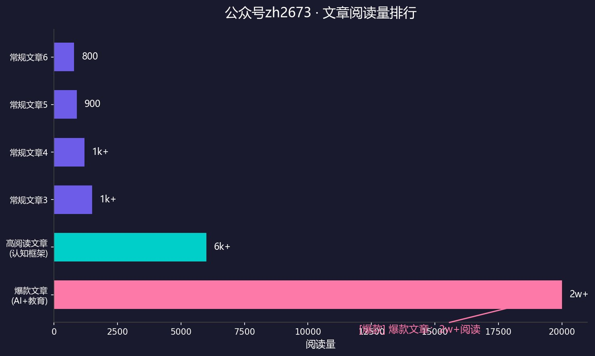
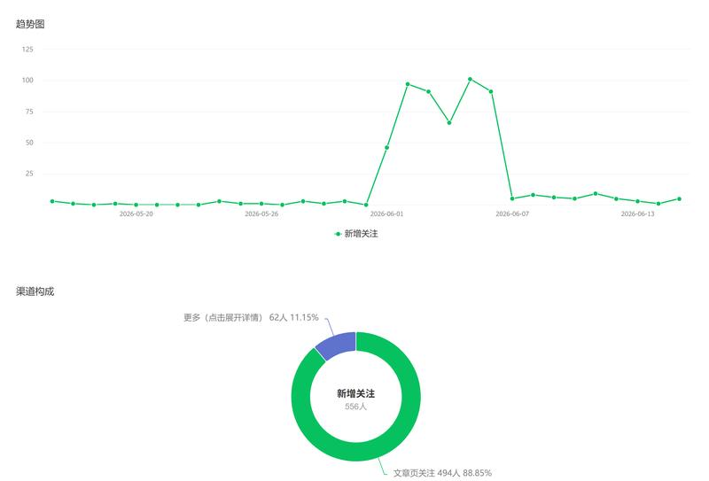

# 实战案例：公众号zh2673自动化运营

> 本案例展示了如何用本质工坊的场景E（内容输出）+ 场景B2（话题蒸馏），实现公众号全自动化运营。
> 一个月内出现爆款文章，集中带来显著用户增长。

## 背景

公众号zh2673由一个人维护，在引入本质工坊之前，内容生产效率低、产出不稳定。引入本质工坊后，实现了从选题到发布的全流程自动化。

## 自动化流程

```
场景B2（话题蒸馏）→ 场景E（内容输出）→ 公众号管线
     ↓                    ↓                  ↓
  选题+素材生成      文章+配图+排版      受限HTML推送
```

| 步骤 | 本质工坊场景 | 输出 |
|------|-------------|------|
| 1. 选题 | 场景B2 + topic-selection规范 | 选题列表+选题理由 |
| 2. 素材生成 | 场景A + 场景B2 | 结构化素材+蒸馏视角 |
| 3. 文章写作 | 场景E 公众号管线 + writing-style-guide | 微信受限HTML |
| 4. 配图 | 元素层（图形元素）+ brand_extractor | 品牌风格配图 |
| 5. 排版 | 公众号管线 converter.py | 适配微信编辑器 |
| 6. 推送 | 公众号管线 publish.py | 自动发布 |
| 7. 检查 | wechat-formatting规范 | 格式合规检查 |

## 关键成果

- **爆款文章**：单篇阅读量2w+，另有6k+高阅读文章，远超日常平均



- **用户增长**：涨粉近600，爆款集中带来增长，并持续发挥长尾效应



- **全自动化**：选题→生成→配图→推送→检查，无需人工干预

## 核心洞察

1. **选题比写作更重要**：场景B2的蒸馏视角让选题有深度，不是追热点而是追本质
2. **风格一致性**：writing-style-guide + brand-spec确保每篇文章风格统一
3. **三层架构的威力**：同一素材在元素层生成一次，可走多条管线
4. **自动化≠低质量**：蒸馏场景提供的深度思考让文章质量反而更高

## 涉及场景

- **场景B2**（话题蒸馏）：选题+素材深度
- **场景E**（内容输出）：公众号管线全流程
- **场景F**（Skill优化）：持续优化写作风格和选题策略
