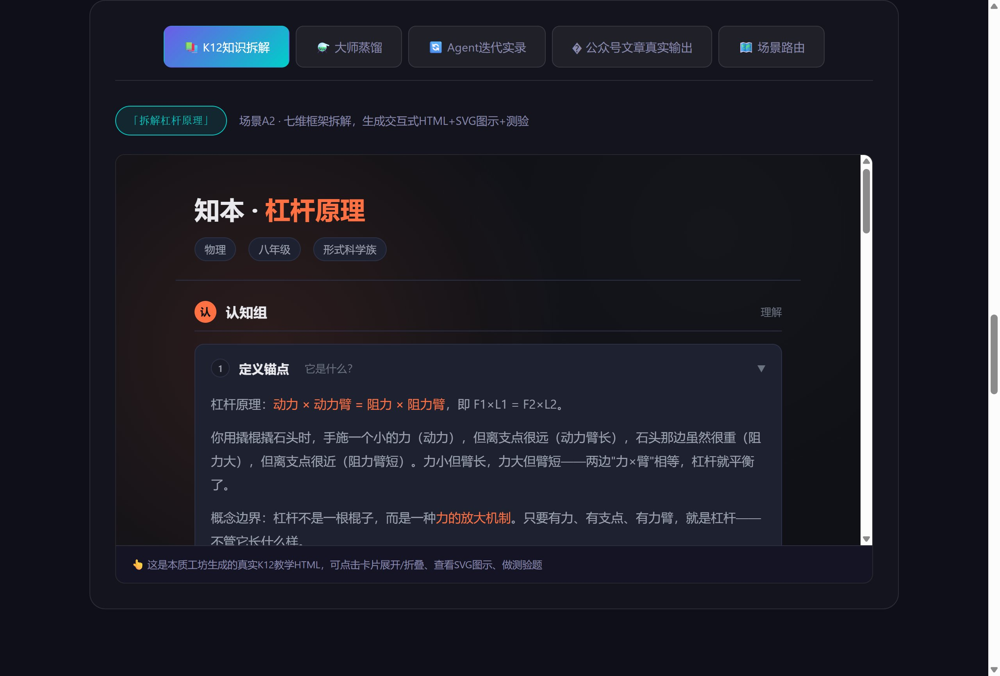
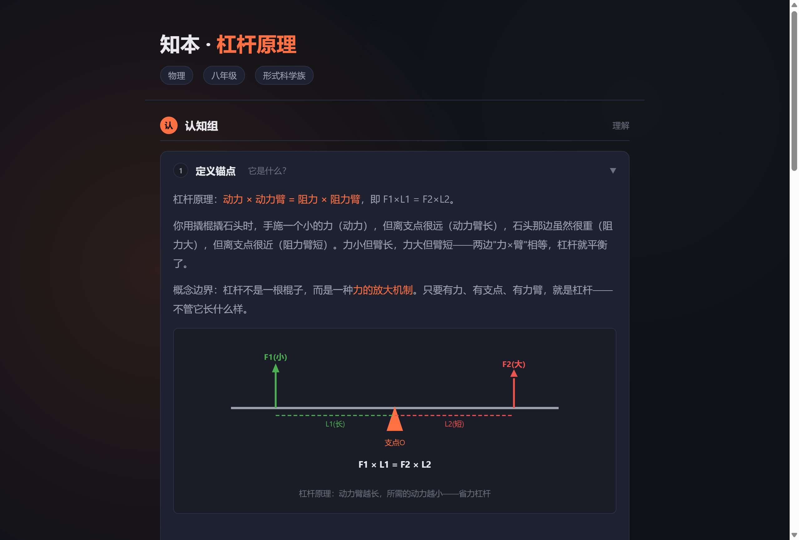
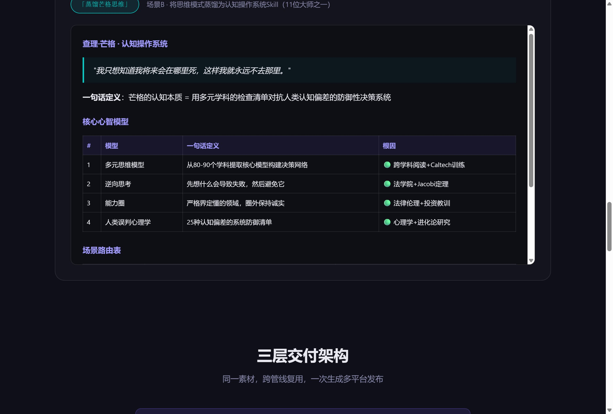
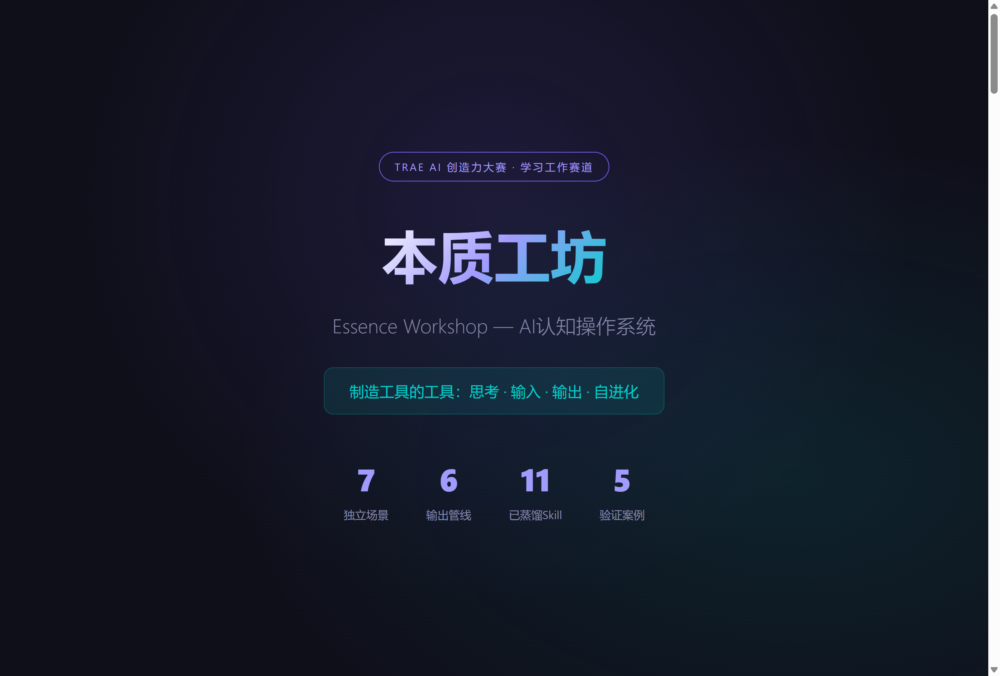
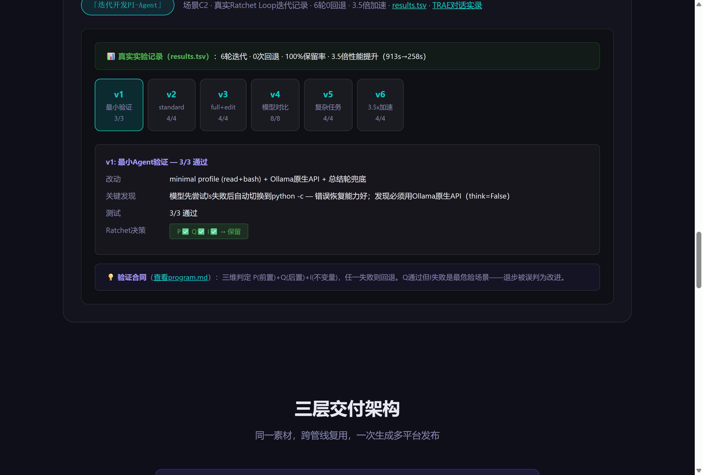
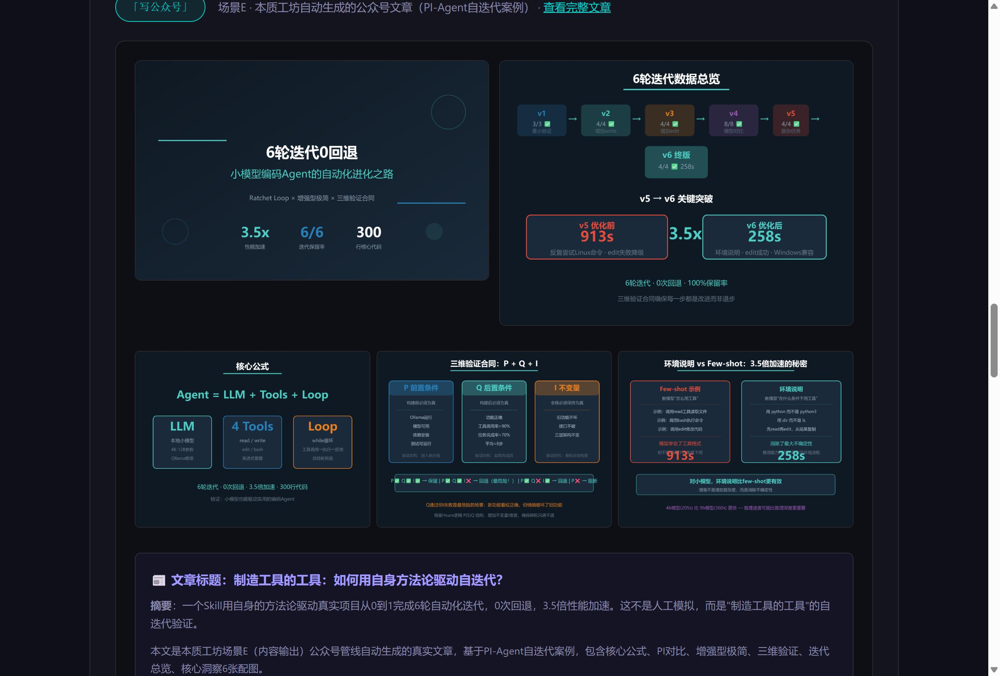

# 【学习工作赛道】本质工坊Demo——制造工具的工具，AI认知操作系统

> **标签**：学习工作
>
> **报名帖**：https://forum.trae.cn/t/topic/25672

---

## 1. Demo简介

**是什么**：本质工坊是一个 TRAE IDE Skill（AI认知操作系统），采用联邦式架构（7个独立子Skill + 1个路由Skill），覆盖认知全链路：思考（知识探索+蒸馏）→ 输入（多角度调研+材料验证）→ 输出（6条管线多平台发布）→ 自进化（Skill优化循环）。它不是单一工具，而是**制造工具的工具**——任何人都可以用它把自己的方法论变成可复用的AI Skill。

**与同类工具的差异**：市面上的造Skill工具大多停留在"流程编排"层面，看似同质化。但流程是表象，真正决定Skill质量的是**看问题的底层视角**。本质工坊的底层不是流程，而是三重视角：

| 视角 | 作用 | 案例 |
|------|------|------|
| **纯逻辑推理视角** | 从约束条件推导必然结论，为业务工具提供不可再减的元信息 | DataDone六层引擎是从"仅有四类数据"纯逻辑推导出来的，不是设计选择 |
| **多维蒸馏视角** | 从30+来源萃取思维DNA（心智模型+决策启发式+场景路由），为认知型Skill提供可复用框架 | 蒸馏芒格思维→生成可独立运行的认知操作系统Skill |
| **自迭代闭环视角** | 规范接口（P/Q/I三维验证）+ Ratchet Loop（只进不退），让Skill具备生命体特征 | PI-Agent 6轮迭代0回退，3.5倍加速 |

**完整闭环**：认知视角（元信息）→ 规范接口（稳定性）→ 自迭代（进化能力）。前两者提供"好的起点"，后者保证"持续变好"。

**面向谁**：
- 知识工作者（研究者、分析师、教师）——需要深度理解并输出结构化内容
- 内容创作者（公众号作者、视频博主、课程讲师）——需要高效选题→创作→发布
- 项目开发者（独立开发者、创业者）——需要从0到1构建并迭代产品
- 学习者（学生、终身学习者）——需要拆解复杂知识为可理解的结构

**主要功能**（3个核心）：

**功能1：知识探索与K12知识拆解**
输入「探索量子计算」或「拆解杠杆原理」，本质工坊用三阶方法论（是什么→为什么→怎么做）和七维框架，生成结构化知识笔记或交互式教学HTML（含SVG图示、测验、知识图谱）。已生成150+个K12知识点HTML，覆盖小学到高中5个学科。

**功能2：大师蒸馏——把思维模式变成AI Skill**
输入「蒸馏芒格思维」，本质工坊从30+个一手/二手来源深度调研，通过三阶蒸馏提炼核心心智模型、决策启发式、场景路由和表达DNA，生成一个可独立运行的认知操作系统Skill。已蒸馏11位大师（芒格、达尔文、爱因斯坦、孔子等）。

**功能3：6条管线内容输出**
输入「写公众号」「做视频」「做PPT」，本质工坊通过三层交付架构（元素层→管线层→平台层），同一素材一次生成多平台发布内容。公众号管线已生产可用，实现了选题→生成文章→配图→推送→检查全自动化。

### 产品截图

**体验中心主界面**（5个可交互标签，真实输出可体验）：



**K12知识拆解**（交互式HTML，含SVG图示、可展开卡片、测验题）：



**大师蒸馏**（芒格认知操作系统Skill，含心智模型表、场景路由表）：



---

## 2. Demo创作思路

**灵感来源**：

起点很简单——我想读懂GitHub上的开源项目。但项目千差万别，每个都要从零理解，效率极低。我意识到不能逐个项目硬啃，必须找到一个通用的理解方式。于是我从哲学的角度切入：任何项目都有其"本质"——剥离表象后不可再减的核心逻辑。如果能从纯逻辑推理出发，就能建立一套通用的认知框架。

后来在做数据分析项目（DataDone）和智能体项目（PI-Agent）时，这套方法论反复验证有效，逐步沉淀出了项目架构、迭代流程、内容输出管线。本质工坊逐渐展现出"缝合怪"的特质——它不断吸收新能力，最终从一个知识探索工具生长成了覆盖认知全链路的AI认知操作系统。

**想解决的问题**（用户真实痛点）：

1. **认知割裂**：思考（理解概念）、输入（调研蒸馏）、输出（写文章做视频）分散在不同工具中，上下文丢失
2. **方法论不可复用**：每次都要从零教AI你的思考方式，无法沉淀
3. **输出格式受限**：同一内容想发公众号、做视频、做PPT，需要分别制作
4. **无法自进化**：AI工具不能自我评估和改进

**为什么做这个方向**：

当前AI工具要么只做一件事（如只写文章、只做PPT），要么什么都能做但浅尝辄止。更关键的是，即使出现了"造Skill的工具"，大多也只停留在流程编排层面——把用户的操作步骤固化下来。但流程是表象，**真正决定Skill质量的是看问题的底层视角**。

本质工坊不做又一个流程编排工具，而是做**提供底层认知视角的元工具**：
- **纯逻辑推理视角**：从约束条件推导必然结论，为业务工具提供不可再减的元信息
- **多维蒸馏视角**：从30+来源萃取思维DNA，为认知型Skill提供可复用框架
- **自迭代闭环视角**：规范接口（P/Q/I三维验证）+ Ratchet Loop，让Skill持续进化

这三重视角加上规范接口思维和自迭代逻辑，形成完整闭环：认知视角提供好的起点，规范接口保证稳定性，自迭代保证持续变好。这个方向的选择基于一个判断——AI的价值不在于替代人思考，而在于放大人的方法论。

---

## 3. Demo体验地址

**体验方式**：交互式可体验的HTML格式文件（Zip打包上传）

> 📌 **上传文件**：将 `cases/` 目录打包为 zip 上传，包含：
> - `创意产物-本质工坊.html`（主Demo页面）
> - `images/`（案例图片）
> - `samples/k12-lever.html`（K12真实输出样本）
> - `samples/pi-agent/results.tsv` + `program.md`（PI-Agent真实迭代记录）
> - `samples/wechat-article/article.md` + 6张配图（公众号文章真实输出）

**体验内容**：

打开HTML后，向下滚动到「体验中心」模块，可点击5个标签交互体验：

1. **📚 K12知识拆解**：嵌入真实的K12教学HTML（杠杆原理），可点击卡片展开/折叠、查看SVG图示、做测验题
2. **⚗️ 大师蒸馏**：查看芒格认知操作系统Skill的完整结构（心智模型表、场景路由表、根因追溯）
3. **🔄 Agent迭代实录**：点击PI-Agent 6轮迭代时间线，查看每轮真实记录。可点击查看真实的 [results.tsv](samples/pi-agent/results.tsv) 实验记录和 [program.md](samples/pi-agent/program.md) 验证合同
4. **📰 公众号文章真实输出**：查看本质工坊自动生成的公众号文章《制造工具的工具：如何用自身方法论驱动自迭代？》，含6张自动配图、文章摘要、三个反直觉发现。可点击查看 [完整文章](samples/wechat-article/article.md)
5. **🗺️ 场景路由**：点击触发词，查看路由Skill如何识别意图并调度对应子Skill

**GitHub开源地址**：https://github.com/zh2673-git/essence-workshop

**PI-Agent完整项目**：包含真实的项目代码、测试脚本、迭代记录、教学notebook，路径结构：
```
从0到1学习agent/
├── 目标.md                    # 初始输入（调用本质工坊的起点）
├── 从0到1学习Agent目标.md     # TRAE会话导出记录
├── distillation/output/       # 场景B蒸馏PI框架的输出
├── project/                   # 场景C2迭代开发的真实产物
│   ├── program.md             # 验证合同（人类控制迭代的接口）
│   ├── results.tsv            # 真实实验记录（6轮，不可篡改）
│   ├── src/pi_agent/          # 真实项目代码
│   └── tests/                 # test_v1.py ~ test_v6.py（每轮测试）
├── notebook/                  # 场景E Notebook管线输出
└── output/wechat/             # 场景E公众号管线自动生成的文章+6张配图
```

---

## 4. TRAE实践过程

本质工坊从构思到完成，全程在 TRAE IDE 中开发。以下是关键开发流程：

### 阶段1：架构设计与路由Skill开发

用 TRAE IDE 设计了联邦式架构：7个独立子Skill + 1个路由Skill。路由Skill的 SKILL.md 包含场景路由表，根据触发词调度对应子Skill。

**TRAE对话实录**（PI-Agent项目开发全过程，包含场景B2→C2→E的完整调度）：



> 完整对话实录：[samples/pi-agent/从0到1学习Agent目标.md](samples/pi-agent/从0到1学习Agent目标.md)（50KB，660+行，TRAE IDE会话导出）
>
> 可视化版本：[samples/pi-agent/trae-session-record.html](samples/pi-agent/trae-session-record.html)（美化版HTML，可在浏览器中查看）

### 阶段2：7大场景子Skill开发

逐一开发7个场景子Skill，每个自包含（references + templates + scripts）：
- 场景A：知识探索（三阶正向推导）
- 场景A2：K12知识拆解（七维框架+交互式HTML+知识图谱）
- 场景B+B2：人物/话题蒸馏（认知操作系统Skill生成）
- 场景C+C2：项目开发（含Ratchet Loop迭代开发）
- 场景D：项目解析（逆向分析+Obsidian笔记）
- 场景E：内容输出（6条管线）
- 场景F：Skill优化（评估→改进→验证循环）

**子Skill开发成果截图**：


> 以上截图展示了场景A2（K12知识拆解）和场景B（大师蒸馏）两个子Skill的真实输出。完整对话实录见阶段1的TRAE对话实录。

### 阶段3：真实案例验证——PI-Agent自迭代（核心案例）

这是最具说服力的真实案例：**本质工坊用自身的方法论驱动自身进化**。在TRAE IDE中输入目标后，本质工坊自动完成了全流程。

**完整的TRAE IDE对话实录**：[samples/pi-agent/从0到1学习Agent目标.md](samples/pi-agent/从0到1学习Agent目标.md)（50KB，660+行，从目标输入到6轮迭代完成的完整会话导出）

**可视化对话实录**：[samples/pi-agent/trae-session-record.html](samples/pi-agent/trae-session-record.html)（美化版HTML，可在浏览器中查看）


**输入**（[目标.md](file:///D:/self_test/project/trae/agent/从0到1学习agent/目标.md)）：
> 调研本质工坊skill，开发一个基于pi实现的Agent，你需要先用蒸馏场景研究一下pi的实现，然后形成开发场景的方案。要求能从0到1学习Agent的全过程...我本地有ollama，需要用用其中有的不同的小尺寸模型进行测试，然后自我迭代，反复探索...

**对话中的关键节点**（实录中可见）：
1. **User提问"是否是按照skill本身形成项目方案？"** → 本质工坊自我纠正，严格遵循Skill方法论
2. **User提问"你应该调用本质工坊skill，自动迭代？"** → 本质工坊切换到自动迭代模式，严格执行Ratchet Loop
3. **6轮迭代全部保留**：每轮都有真实的改动、发现、测试结果、Ratchet决策

**本质工坊自动调度的场景链**：
- 场景B2（蒸馏）→ 研究PI框架，输出 [distillation/output/pi-agent/](file:///D:/self_test/project/trae/agent/从0到1学习agent/distillation/output/pi-agent/)
- 场景C2（迭代开发）→ Ratchet Loop 6轮迭代，输出 [project/](file:///D:/self_test/project/trae/agent/从0到1学习agent/project/)（含真实代码、测试、[results.tsv](file:///D:/self_test/project/trae/agent/从0到1学习agent/project/results.tsv)、[program.md](file:///D:/self_test/project/trae/agent/从0到1学习agent/project/program.md)）
- 场景E（Notebook管线）→ 输出 [notebook/从0到1学习Agent.md](file:///D:/self_test/project/trae/agent/从0到1学习agent/notebook/从0到1学习Agent.md) 教学notebook
- 场景E（公众号管线）→ 自动生成 [output/wechat/article.md](file:///D:/self_test/project/trae/agent/从0到1学习agent/output/wechat/article.md) + 6张配图

**真实成果**：
- 6轮迭代，0次回退，100%保留率（[results.tsv](file:///D:/self_test/project/trae/agent/从0到1学习agent/project/results.tsv) 可验证）
- 3.5倍性能提升（913s→258s）
- 4b模型完成复杂编码任务
- 自动生成教学notebook + 公众号文章

**PI-Agent迭代实录截图**（点击查看6轮迭代详情）：



**公众号文章真实输出截图**（本质工坊自动生成的文章+6张配图）：



> 📌 **Session ID**：完整对话实录见 [samples/pi-agent/从0到1学习Agent目标.md](samples/pi-agent/从0到1学习Agent目标.md)（TRAE IDE会话导出，660+行，含完整Session信息）

### 阶段4：其他真实案例验证

除PI-Agent外，还完成了4个真实案例：
1. **公众号zh2673自动化运营**：选题→生成→配图→推送→检查全自动化，单篇2w+阅读，涨粉近600
2. **DataDone-RE本质驱动重构**：从纯逻辑推理推导出六层递进分析引擎
3. **GitHub项目→Obsidian笔记**：解析任意GitHub项目，自动生成结构化笔记
4. **知本K12知识图谱**：150+知识点HTML，覆盖小初高5学科

### 阶段5：Demo体验页开发

用 TRAE IDE 开发了交互式Demo体验页（本文件），包含：
- 静态展示部分（架构、场景、案例）
- 交互式体验中心（5个可交互模块）
- 嵌入真实输出素材（K12 HTML、蒸馏Skill内容、PI-Agent迭代记录）

**Demo体验页截图**：


---

## 附：报名帖链接

报名帖：https://forum.trae.cn/t/topic/25672

---

> **备注**：所有截图均为Demo真实运行截图。TRAE对话实录完整保存在 [samples/pi-agent/从0到1学习Agent目标.md](samples/pi-agent/从0到1学习Agent目标.md)（660+行，含完整Session信息）。
